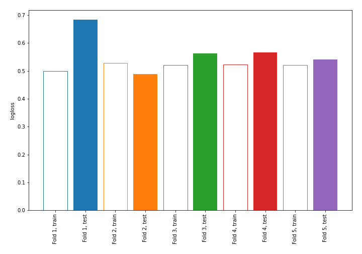
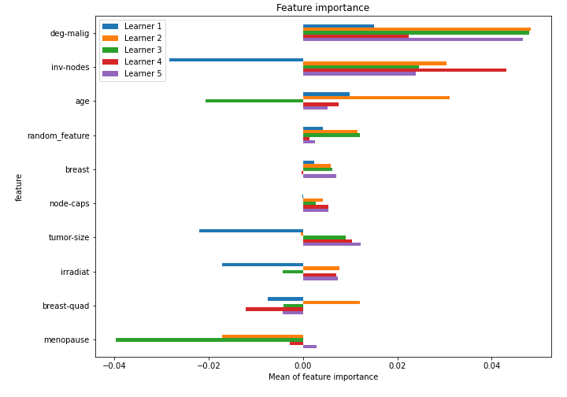

# Summary of 1_Linear_RandomFeature

[<< Go back](../README.md)

## Logistic Regression (Linear)
- **n_jobs**: -1
- **explain_level**: 1

## Validation
 - **validation_type**: kfold
 - **k_folds**: 5
 - **shuffle**: True
 - **stratify**: True

## Optimized metric
logloss

## Training time

1.7 seconds

## Metric details
|           |    score |   threshold |
|:----------|---------:|------------:|
| logloss   | 0.568243 | nan         |
| auc       | 0.678056 | nan         |
| f1        | 0.516129 |   0.316875  |
| accuracy  | 0.75     |   0.432252  |
| precision | 0.666667 |   0.644171  |
| recall    | 1        |   0.0346604 |
| mcc       | 0.341148 |   0.419176  |

## Confusion matrix (at threshold=0.432252)
|                     |   Predicted as negative |   Predicted as positive |
|:--------------------|------------------------:|------------------------:|
| Labeled as negative |                     144 |                      19 |
| Labeled as positive |                      38 |                      27 |

## Learning curves

## Coefficients
| feature        |   Learner_1 |   Learner_2 |   Learner_3 |   Learner_4 |   Learner_5 |
|:---------------|------------:|------------:|------------:|------------:|------------:|
| deg-malig      |  0.411265   |   0.354224  |   0.44182   |   0.556041  |   0.421302  |
| inv-nodes      |  0.567675   |   0.352559  |   0.374058  |   0.170872  |   0.292648  |
| tumor-size     |  0.330911   |   0.249814  |   0.101215  |   0.213023  |   0.230676  |
| node-caps      |  0.0130967  |   0.152201  |   0.0851603 |   0.266643  |   0.249009  |
| irradiat       |  0.181309   |   0.0816147 |   0.177929  |   0.0523219 |   0.12731   |
| breast-quad    |  0.143143   |   0.179613  |   0.168729  |  -0.111449  |   0.160104  |
| random_feature | -0.0549855  |   0.3672    |   0.123595  |   0.219297  |  -0.303561  |
| menopause      | -0.00142542 |  -0.173541  |   0.212154  |  -0.0753359 |   0.0935674 |
| breast         | -0.193256   |  -0.140329  |  -0.0987114 |   0.0293598 |  -0.12696   |
| age            | -0.131332   |  -0.250153  |  -0.161255  |  -0.229687  |  -0.0580584 |
| intercept      | -1.10054    |  -1.06814   |  -1.0734    |  -1.09913   |  -1.0843    |

## Permutation-based Importance

[<< Go back](../README.md)
