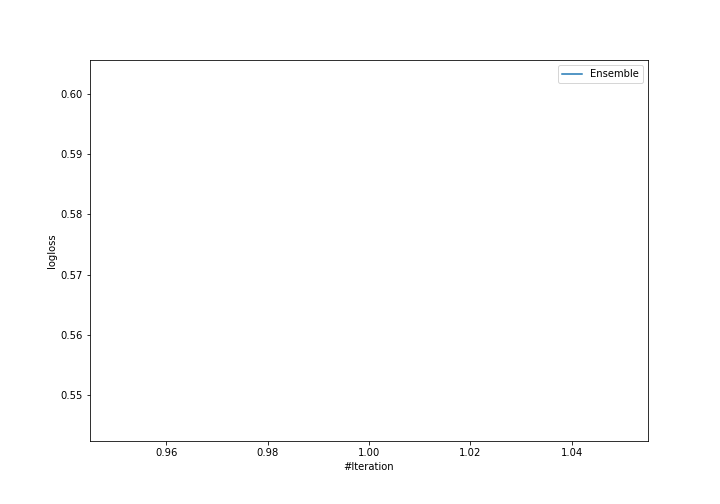

# Summary of Ensemble

[<< Go back](../README.md)

## Ensemble structure
| Model    |   Weight |
|:---------|---------:|
| 1_Linear |        1 |

## Metric details
|           |    score |   threshold |
|:----------|---------:|------------:|
| logloss   | 0.573976 | nan         |
| auc       | 0.671543 | nan         |
| f1        | 0.518987 |   0.308481  |
| accuracy  | 0.741228 |   0.557787  |
| precision | 0.625    |   0.557787  |
| recall    | 1        |   0.0339967 |
| mcc       | 0.325183 |   0.409163  |

## Confusion matrix (at threshold=0.557787)
|                     |   Predicted as negative |   Predicted as positive |
|:--------------------|------------------------:|------------------------:|
| Labeled as negative |                     154 |                       9 |
| Labeled as positive |                      50 |                      15 |

## Learning curves

[<< Go back](../README.md)
