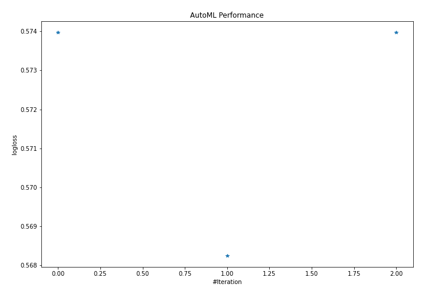

# AutoML Leaderboard

| Best model   | name                                                       | model_type   | metric_type   |   metric_value |   train_time |   single_prediction_time |
|:-------------|:-----------------------------------------------------------|:-------------|:--------------|---------------:|-------------:|-------------------------:|
|              | [1_Linear](1_Linear/README.md)                             | Linear       | logloss       |       0.573976 |         8.41 |                   0.0959 |
| **the best** | [1_Linear_RandomFeature](1_Linear_RandomFeature/README.md) | Linear       | logloss       |       0.568243 |         2.11 |                   0.1008 |
|              | [Ensemble](Ensemble/README.md)                             | Ensemble     | logloss       |       0.573976 |         0.42 |                   0.2099 |

### AutoML Performance

### AutoML Performance Boxplot
