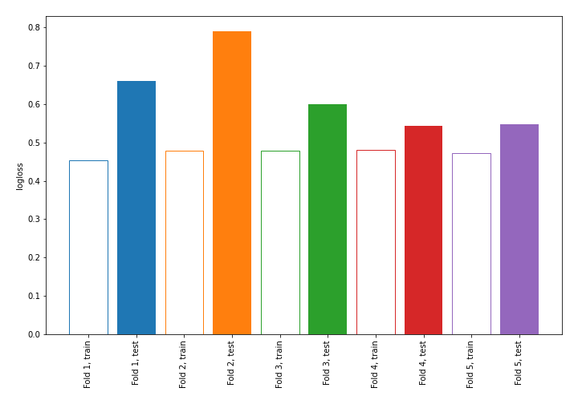

# Summary of 1_DecisionTree_KMeansFeatures

[<< Go back](../README.md)

## Decision Tree
- **n_jobs**: -1
- **criterion**: gini
- **max_depth**: 3
- **explain_level**: 0

## Validation
 - **validation_type**: kfold
 - **shuffle**: True
 - **stratify**: True
 - **k_folds**: 5

## Optimized metric
logloss

## Training time

1.0 seconds

## Metric details
|           |    score |   threshold |
|:----------|---------:|------------:|
| logloss   | 0.62818  |  nan        |
| auc       | 0.651015 |  nan        |
| f1        | 0.486692 |    0.125903 |
| accuracy  | 0.741228 |    0.65     |
| precision | 0.625    |    0.65     |
| recall    | 1        |    0        |
| mcc       | 0.258251 |    0.65     |

## Confusion matrix (at threshold=0.65)
|                     |   Predicted as negative |   Predicted as positive |
|:--------------------|------------------------:|------------------------:|
| Labeled as negative |                     154 |                       9 |
| Labeled as positive |                      50 |                      15 |

## Learning curves

[<< Go back](../README.md)
