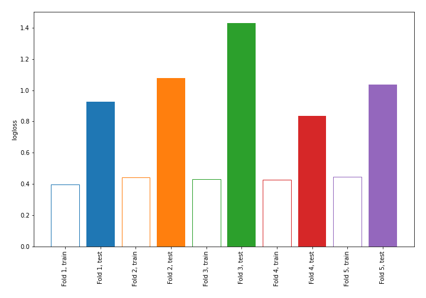

# Summary of 3_DecisionTree

[<< Go back](../README.md)

## Decision Tree
- **n_jobs**: -1
- **criterion**: gini
- **max_depth**: 4
- **explain_level**: 0

## Validation
 - **validation_type**: kfold
 - **shuffle**: True
 - **stratify**: True
 - **k_folds**: 5

## Optimized metric
logloss

## Training time

0.4 seconds

## Metric details
|           |    score |   threshold |
|:----------|---------:|------------:|
| logloss   | 1.06173  |       nan   |
| auc       | 0.641293 |       nan   |
| f1        | 0.494297 |         0   |
| accuracy  | 0.723684 |         0.6 |
| precision | 0.535714 |         0.6 |
| recall    | 1        |         0   |
| mcc       | 0.245805 |         0   |

## Confusion matrix (at threshold=0.6)
|                     |   Predicted as negative |   Predicted as positive |
|:--------------------|------------------------:|------------------------:|
| Labeled as negative |                     150 |                      13 |
| Labeled as positive |                      50 |                      15 |

## Learning curves

[<< Go back](../README.md)
