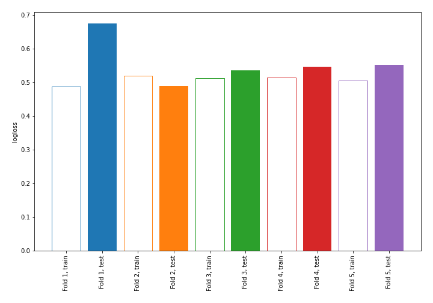

# Summary of 4_Linear_KMeansFeatures

[<< Go back](../README.md)

## Logistic Regression (Linear)
- **n_jobs**: -1
- **explain_level**: 0

## Validation
 - **validation_type**: kfold
 - **shuffle**: True
 - **stratify**: True
 - **k_folds**: 5

## Optimized metric
logloss

## Training time

1.2 seconds

## Metric details
|           |    score |   threshold |
|:----------|---------:|------------:|
| logloss   | 0.559397 | nan         |
| auc       | 0.679094 | nan         |
| f1        | 0.550725 |   0.346209  |
| accuracy  | 0.758772 |   0.459348  |
| precision | 0.666667 |   0.655538  |
| recall    | 1        |   0.0492162 |
| mcc       | 0.35793  |   0.346209  |

## Confusion matrix (at threshold=0.459348)
|                     |   Predicted as negative |   Predicted as positive |
|:--------------------|------------------------:|------------------------:|
| Labeled as negative |                     146 |                      17 |
| Labeled as positive |                      38 |                      27 |

## Learning curves

[<< Go back](../README.md)
