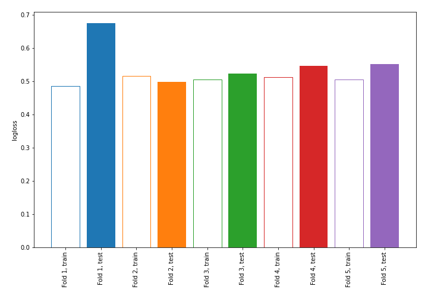
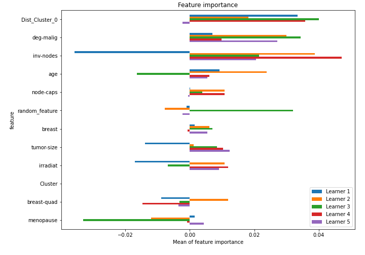

# Summary of 4_Linear_KMeansFeatures_RandomFeature

[<< Go back](../README.md)

## Logistic Regression (Linear)
- **n_jobs**: -1
- **explain_level**: 1

## Validation
 - **validation_type**: kfold
 - **shuffle**: True
 - **stratify**: True
 - **k_folds**: 5

## Optimized metric
logloss

## Training time

1.8 seconds

## Metric details
|           |    score |   threshold |
|:----------|---------:|------------:|
| logloss   | 0.55967  | nan         |
| auc       | 0.678528 | nan         |
| f1        | 0.531469 |   0.337463  |
| accuracy  | 0.758772 |   0.535907  |
| precision | 0.684211 |   0.661814  |
| recall    | 1        |   0.0450162 |
| mcc       | 0.339347 |   0.51169   |

## Confusion matrix (at threshold=0.535907)
|                     |   Predicted as negative |   Predicted as positive |
|:--------------------|------------------------:|------------------------:|
| Labeled as negative |                     151 |                      12 |
| Labeled as positive |                      43 |                      22 |

## Learning curves

## Coefficients
| feature        |   Learner_1 |   Learner_2 |   Learner_3 |   Learner_4 |   Learner_5 |
|:---------------|------------:|------------:|------------:|------------:|------------:|
| Dist_Cluster_0 |   0.403139  |    0.376414 |    0.329148 |   0.374007  |   0.474517  |
| inv-nodes      |   0.577003  |    0.355102 |    0.381336 |   0.190604  |   0.343287  |
| deg-malig      |   0.333463  |    0.257117 |    0.365365 |   0.463797  |   0.323242  |
| tumor-size     |   0.311013  |    0.30369  |    0.115771 |   0.235349  |   0.229297  |
| node-caps      |   0.0675683 |    0.176292 |    0.16872  |   0.288683  |   0.325007  |
| irradiat       |   0.21555   |    0.112533 |    0.189468 |   0.0845637 |   0.171819  |
| breast-quad    |   0.151918  |    0.181046 |    0.157323 |  -0.125925  |   0.141445  |
| menopause      |   0.0378015 |   -0.114363 |    0.207722 |  -0.0231672 |   0.109917  |
| Cluster        |   0         |    0        |    0        |   0         |   0         |
| random_feature |  -0.0828048 |    0.307645 |   -0.46939  |  -0.0181472 |   0.0274113 |
| breast         |  -0.180993  |   -0.165818 |   -0.114271 |   0.0406781 |  -0.109132  |
| age            |  -0.161068  |   -0.197848 |   -0.154974 |  -0.213457  |  -0.058335  |
| intercept      |  -1.11247   |   -1.065    |   -1.08605  |  -1.07174   |  -1.08876   |

## Permutation-based Importance

[<< Go back](../README.md)
