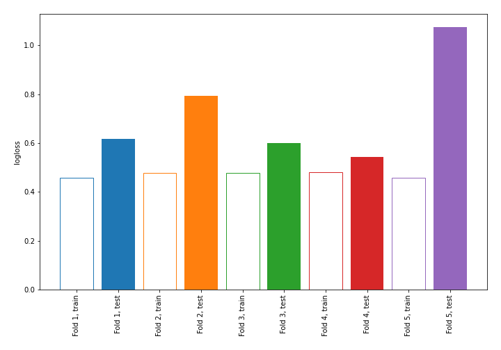

# Summary of 5_DecisionTree

[<< Go back](../README.md)

## Decision Tree
- **n_jobs**: -1
- **criterion**: entropy
- **max_depth**: 3
- **explain_level**: 0

## Validation
 - **validation_type**: kfold
 - **shuffle**: True
 - **stratify**: True
 - **k_folds**: 5

## Optimized metric
logloss

## Training time

0.7 seconds

## Metric details
|           |    score |   threshold |
|:----------|---------:|------------:|
| logloss   | 0.724394 |  nan        |
| auc       | 0.640916 |  nan        |
| f1        | 0.488722 |    0        |
| accuracy  | 0.736842 |    0.611111 |
| precision | 0.6      |    0.611111 |
| recall    | 1        |    0        |
| mcc       | 0.244791 |    0.611111 |

## Confusion matrix (at threshold=0.611111)
|                     |   Predicted as negative |   Predicted as positive |
|:--------------------|------------------------:|------------------------:|
| Labeled as negative |                     153 |                      10 |
| Labeled as positive |                      50 |                      15 |

## Learning curves

[<< Go back](../README.md)
