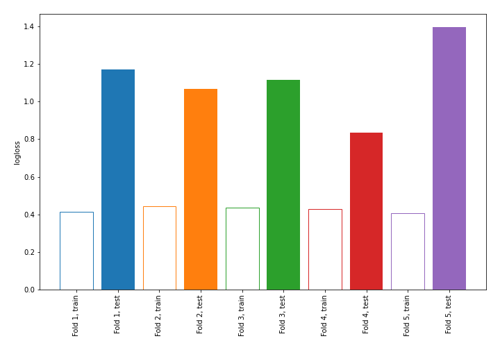

# Summary of 7_DecisionTree

[<< Go back](../README.md)

## Decision Tree
- **n_jobs**: -1
- **criterion**: entropy
- **max_depth**: 4
- **explain_level**: 0

## Validation
 - **validation_type**: kfold
 - **shuffle**: True
 - **stratify**: True
 - **k_folds**: 5

## Optimized metric
logloss

## Training time

0.3 seconds

## Metric details
|           |    score |   threshold |
|:----------|---------:|------------:|
| logloss   | 1.11627  |  nan        |
| auc       | 0.634167 |  nan        |
| f1        | 0.490566 |    0        |
| accuracy  | 0.723684 |    0.601942 |
| precision | 0.533333 |    0.601942 |
| recall    | 1        |    0        |
| mcc       | 0.222697 |    0.46129  |

## Confusion matrix (at threshold=0.601942)
|                     |   Predicted as negative |   Predicted as positive |
|:--------------------|------------------------:|------------------------:|
| Labeled as negative |                     149 |                      14 |
| Labeled as positive |                      49 |                      16 |

## Learning curves

[<< Go back](../README.md)
