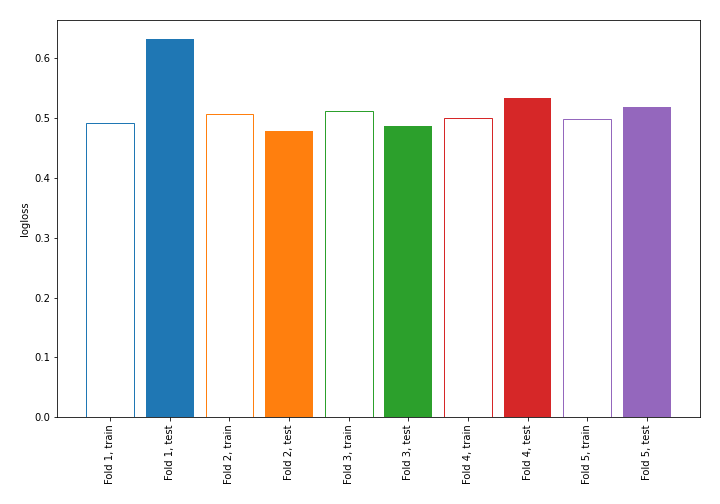

# Summary of 8_DecisionTree

[<< Go back](../README.md)

## Decision Tree
- **n_jobs**: -1
- **criterion**: gini
- **max_depth**: 2
- **explain_level**: 0

## Validation
 - **validation_type**: kfold
 - **shuffle**: True
 - **stratify**: True
 - **k_folds**: 5

## Optimized metric
logloss

## Training time

0.7 seconds

## Metric details
|           |    score |   threshold |
|:----------|---------:|------------:|
| logloss   | 0.529829 |  nan        |
| auc       | 0.663521 |  nan        |
| f1        | 0.484848 |    0.151126 |
| accuracy  | 0.763158 |    0.508586 |
| precision | 0.703704 |    0.508586 |
| recall    | 1        |    0        |
| mcc       | 0.339847 |    0.508586 |

## Confusion matrix (at threshold=0.508586)
|                     |   Predicted as negative |   Predicted as positive |
|:--------------------|------------------------:|------------------------:|
| Labeled as negative |                     155 |                       8 |
| Labeled as positive |                      46 |                      19 |

## Learning curves

[<< Go back](../README.md)
