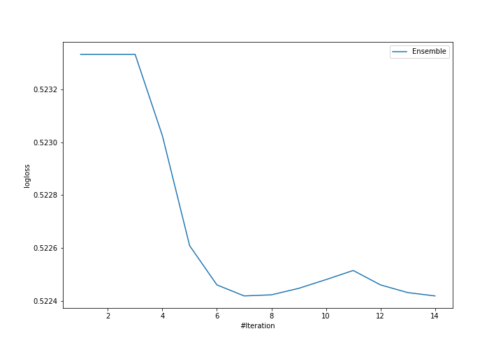

# Summary of Ensemble

[<< Go back](../README.md)

## Ensemble structure
| Model                   |   Weight |
|:------------------------|---------:|
| 10_DecisionTree         |        6 |
| 4_Linear_KMeansFeatures |        1 |

## Metric details
|           |    score |    threshold |
|:----------|---------:|-------------:|
| logloss   | 0.522419 | nan          |
| auc       | 0.688532 | nan          |
| f1        | 0.511364 |   0.239856   |
| accuracy  | 0.763158 |   0.491416   |
| precision | 1        |   0.804456   |
| recall    | 1        |   0.00703089 |
| mcc       | 0.339847 |   0.491416   |

## Confusion matrix (at threshold=0.491416)
|                     |   Predicted as negative |   Predicted as positive |
|:--------------------|------------------------:|------------------------:|
| Labeled as negative |                     155 |                       8 |
| Labeled as positive |                      46 |                      19 |

## Learning curves

[<< Go back](../README.md)
