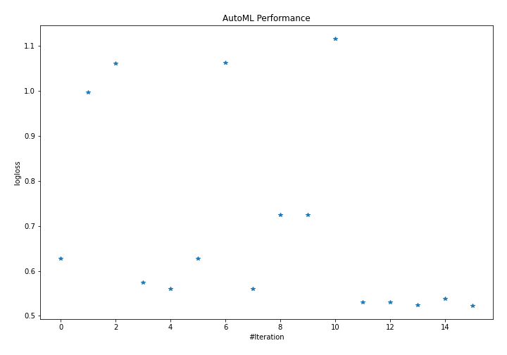
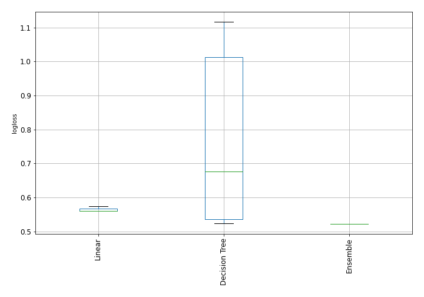

# AutoML Leaderboard

| Best model   | name                                                                                     | model_type    | metric_type   |   metric_value |   train_time |
|:-------------|:-----------------------------------------------------------------------------------------|:--------------|:--------------|---------------:|-------------:|
|              | [1_DecisionTree](1_DecisionTree/README.md)                                               | Decision Tree | logloss       |       0.62818  |         1.33 |
|              | [2_DecisionTree](2_DecisionTree/README.md)                                               | Decision Tree | logloss       |       0.997019 |         0.84 |
|              | [3_DecisionTree](3_DecisionTree/README.md)                                               | Decision Tree | logloss       |       1.06173  |         0.62 |
|              | [4_Linear](4_Linear/README.md)                                                           | Linear        | logloss       |       0.573976 |         1.32 |
|              | [4_Linear_KMeansFeatures](4_Linear_KMeansFeatures/README.md)                             | Linear        | logloss       |       0.559397 |         1.43 |
|              | [1_DecisionTree_KMeansFeatures](1_DecisionTree_KMeansFeatures/README.md)                 | Decision Tree | logloss       |       0.62818  |         1.28 |
|              | [2_DecisionTree_KMeansFeatures](2_DecisionTree_KMeansFeatures/README.md)                 | Decision Tree | logloss       |       1.06261  |         0.85 |
|              | [4_Linear_KMeansFeatures_RandomFeature](4_Linear_KMeansFeatures_RandomFeature/README.md) | Linear        | logloss       |       0.55967  |         2.49 |
|              | [5_DecisionTree](5_DecisionTree/README.md)                                               | Decision Tree | logloss       |       0.724394 |         0.83 |
|              | [6_DecisionTree](6_DecisionTree/README.md)                                               | Decision Tree | logloss       |       0.724394 |         0.99 |
|              | [7_DecisionTree](7_DecisionTree/README.md)                                               | Decision Tree | logloss       |       1.11627  |         0.53 |
|              | [8_DecisionTree](8_DecisionTree/README.md)                                               | Decision Tree | logloss       |       0.529829 |         0.93 |
|              | [9_DecisionTree](9_DecisionTree/README.md)                                               | Decision Tree | logloss       |       0.529829 |         1.11 |
|              | [10_DecisionTree](10_DecisionTree/README.md)                                             | Decision Tree | logloss       |       0.523332 |         0.9  |
|              | [10_DecisionTree_BoostOnErrors](10_DecisionTree_BoostOnErrors/README.md)                 | Decision Tree | logloss       |       0.537526 |         0.89 |
| **the best** | [Ensemble](Ensemble/README.md)                                                           | Ensemble      | logloss       |       0.522419 |         1.47 |

### AutoML Performance

### AutoML Performance Boxplot
