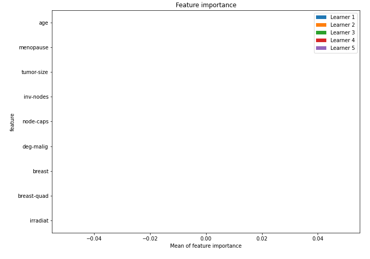

# Summary of 10_Xgboost

[<< Go back](../README.md)

## Extreme Gradient Boosting (Xgboost)
- **n_jobs**: -1
- **objective**: binary:logistic
- **eval_metric**: auc
- **eta**: 0.15
- **max_depth**: 8
- **min_child_weight**: 25
- **subsample**: 0.6
- **colsample_bytree**: 0.6
- **explain_level**: 1

## Validation
 - **validation_type**: kfold
 - **k_folds**: 5
 - **shuffle**: True
 - **stratify**: True

## Optimized metric
logloss

## Training time

1.9 seconds

## Metric details
|           |    score |   threshold |
|:----------|---------:|------------:|
| logloss   | 0.669174 |  nan        |
| auc       | 0.5      |  nan        |
| f1        | 0.443686 |    0.418322 |
| accuracy  | 0.285088 |    0.418322 |
| precision | 0.285088 |    0.418322 |
| recall    | 1        |    0.418322 |
| mcc       | 0        |    0.418322 |

## Confusion matrix (at threshold=0.418322)
|                     |   Predicted as negative |   Predicted as positive |
|:--------------------|------------------------:|------------------------:|
| Labeled as negative |                       0 |                     163 |
| Labeled as positive |                       0 |                      65 |

## Learning curves

## Permutation-based Importance

[<< Go back](../README.md)
