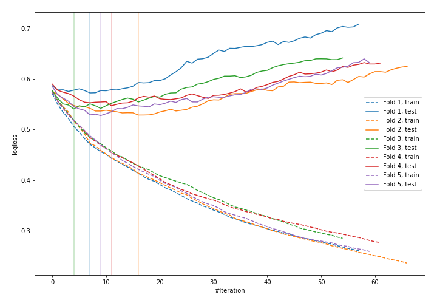
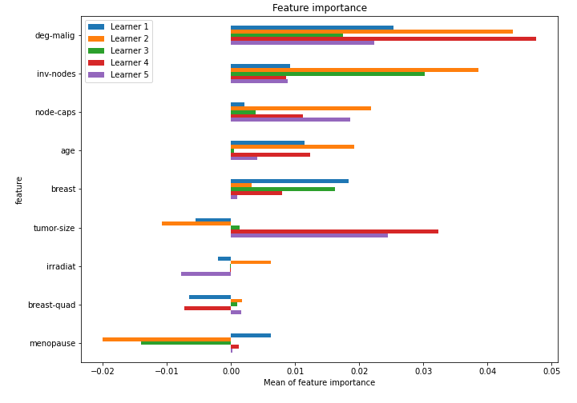

# Summary of 11_LightGBM

[<< Go back](../README.md)

## LightGBM
- **n_jobs**: -1
- **objective**: binary
- **metric**: binary_logloss
- **num_leaves**: 15
- **learning_rate**: 0.1
- **feature_fraction**: 0.8
- **bagging_fraction**: 0.8
- **min_data_in_leaf**: 10
- **explain_level**: 1

## Validation
 - **validation_type**: kfold
 - **k_folds**: 5
 - **shuffle**: True
 - **stratify**: True

## Optimized metric
logloss

## Training time

2.3 seconds

## Metric details
|           |    score |   threshold |
|:----------|---------:|------------:|
| logloss   | 0.543665 | nan         |
| auc       | 0.688768 | nan         |
| f1        | 0.497738 |   0.228839  |
| accuracy  | 0.763158 |   0.499708  |
| precision | 1        |   0.630929  |
| recall    | 1        |   0.0659194 |
| mcc       | 0.336861 |   0.499708  |

## Confusion matrix (at threshold=0.499708)
|                     |   Predicted as negative |   Predicted as positive |
|:--------------------|------------------------:|------------------------:|
| Labeled as negative |                     159 |                       4 |
| Labeled as positive |                      50 |                      15 |

## Learning curves

## Permutation-based Importance

[<< Go back](../README.md)
