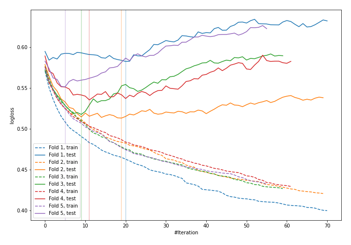
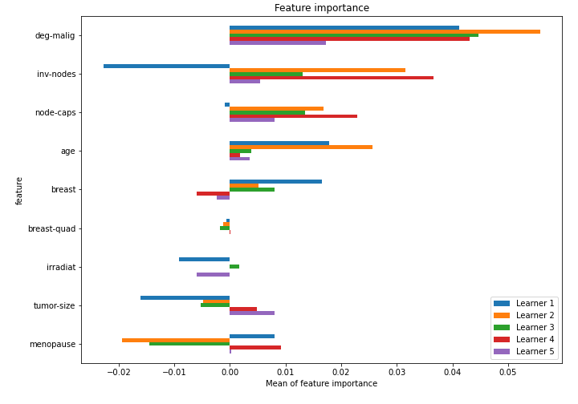

# Summary of 13_LightGBM

[<< Go back](../README.md)

## LightGBM
- **n_jobs**: -1
- **objective**: binary
- **metric**: binary_logloss
- **num_leaves**: 95
- **learning_rate**: 0.2
- **feature_fraction**: 0.9
- **bagging_fraction**: 1.0
- **min_data_in_leaf**: 30
- **explain_level**: 1

## Validation
 - **validation_type**: kfold
 - **k_folds**: 5
 - **shuffle**: True
 - **stratify**: True

## Optimized metric
logloss

## Training time

3.4 seconds

## Metric details
|           |    score |   threshold |
|:----------|---------:|------------:|
| logloss   | 0.539786 | nan         |
| auc       | 0.701793 | nan         |
| f1        | 0.539683 |   0.387862  |
| accuracy  | 0.758772 |   0.496763  |
| precision | 0.8      |   0.580741  |
| recall    | 1        |   0.0548924 |
| mcc       | 0.36452  |   0.387862  |

## Confusion matrix (at threshold=0.496763)
|                     |   Predicted as negative |   Predicted as positive |
|:--------------------|------------------------:|------------------------:|
| Labeled as negative |                     154 |                       9 |
| Labeled as positive |                      46 |                      19 |

## Learning curves

## Permutation-based Importance

[<< Go back](../README.md)
