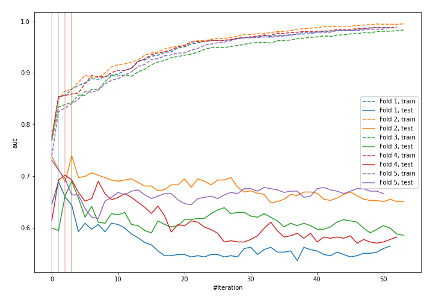

# Summary of 14_LightGBM

[<< Go back](../README.md)

## LightGBM
- **n_jobs**: -1
- **objective**: binary
- **metric**: auc
- **num_leaves**: 31
- **learning_rate**: 0.2
- **feature_fraction**: 0.5
- **bagging_fraction**: 0.8
- **min_data_in_leaf**: 10
- **explain_level**: 1

## Validation
 - **validation_type**: kfold
 - **k_folds**: 5
 - **shuffle**: True
 - **stratify**: True

## Optimized metric
logloss

## Training time

3.1 seconds

## Metric details
|           |    score |   threshold |
|:----------|---------:|------------:|
| logloss   | 0.555781 |  nan        |
| auc       | 0.699056 |  nan        |
| f1        | 0.528571 |    0.30075  |
| accuracy  | 0.75     |    0.35013  |
| precision | 0.857143 |    0.443761 |
| recall    | 1        |    0.122363 |
| mcc       | 0.326635 |    0.330747 |

## Confusion matrix (at threshold=0.35013)
|                     |   Predicted as negative |   Predicted as positive |
|:--------------------|------------------------:|------------------------:|
| Labeled as negative |                     148 |                      15 |
| Labeled as positive |                      42 |                      23 |

## Learning curves

## Permutation-based Importance

[<< Go back](../README.md)
