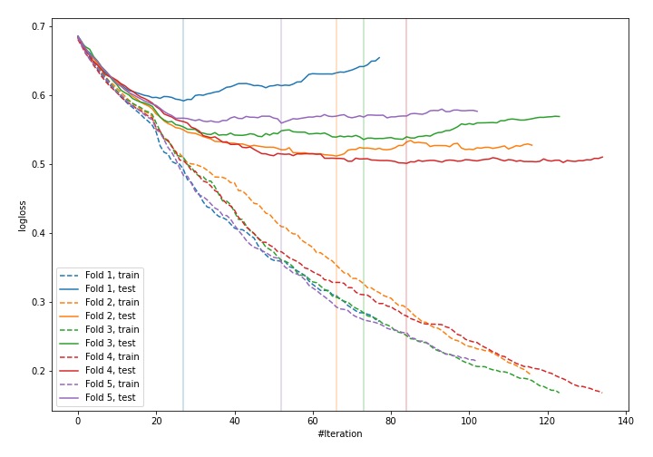
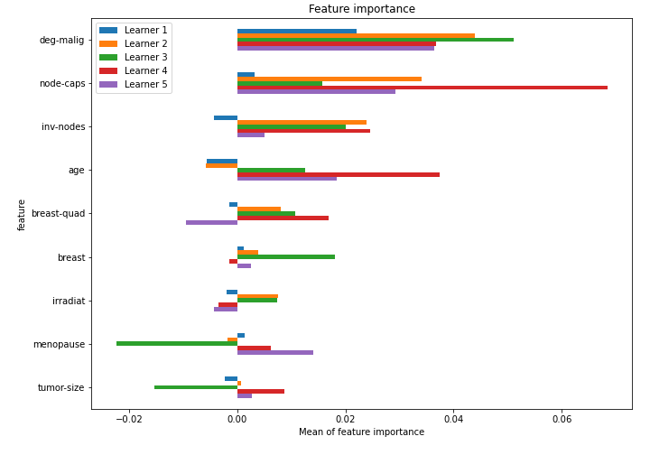

# Summary of 15_CatBoost

[<< Go back](../README.md)

## CatBoost
- **n_jobs**: -1
- **learning_rate**: 0.05
- **depth**: 8
- **rsm**: 0.8
- **loss_function**: Logloss
- **explain_level**: 1

## Validation
 - **validation_type**: kfold
 - **k_folds**: 5
 - **shuffle**: True
 - **stratify**: True

## Optimized metric
logloss

## Training time

6.8 seconds

## Metric details
|           |    score |   threshold |
|:----------|---------:|------------:|
| logloss   | 0.539806 | nan         |
| auc       | 0.701793 | nan         |
| f1        | 0.515723 |   0.293293  |
| accuracy  | 0.758772 |   0.432854  |
| precision | 0.785714 |   0.603824  |
| recall    | 1        |   0.0908764 |
| mcc       | 0.347298 |   0.431256  |

## Confusion matrix (at threshold=0.432854)
|                     |   Predicted as negative |   Predicted as positive |
|:--------------------|------------------------:|------------------------:|
| Labeled as negative |                     149 |                      14 |
| Labeled as positive |                      41 |                      24 |

## Learning curves

## Permutation-based Importance

[<< Go back](../README.md)
