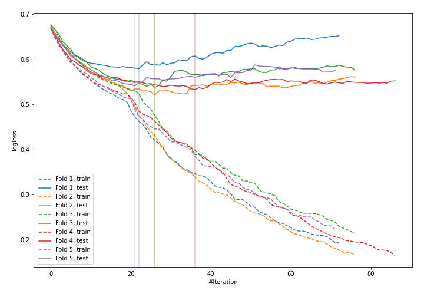
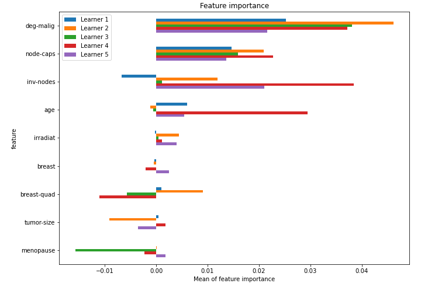

# Summary of 17_CatBoost

[<< Go back](../README.md)

## CatBoost
- **n_jobs**: -1
- **learning_rate**: 0.1
- **depth**: 7
- **rsm**: 1.0
- **loss_function**: Logloss
- **explain_level**: 1

## Validation
 - **validation_type**: kfold
 - **k_folds**: 5
 - **shuffle**: True
 - **stratify**: True

## Optimized metric
logloss

## Training time

6.2 seconds

## Metric details
|           |    score |   threshold |
|:----------|---------:|------------:|
| logloss   | 0.542503 | nan         |
| auc       | 0.697876 | nan         |
| f1        | 0.534351 |   0.350165  |
| accuracy  | 0.77193  |   0.439502  |
| precision | 0.75     |   0.479594  |
| recall    | 1        |   0.0983329 |
| mcc       | 0.375316 |   0.429661  |

## Confusion matrix (at threshold=0.439502)
|                     |   Predicted as negative |   Predicted as positive |
|:--------------------|------------------------:|------------------------:|
| Labeled as negative |                     154 |                       9 |
| Labeled as positive |                      43 |                      22 |

## Learning curves

## Permutation-based Importance

[<< Go back](../README.md)
