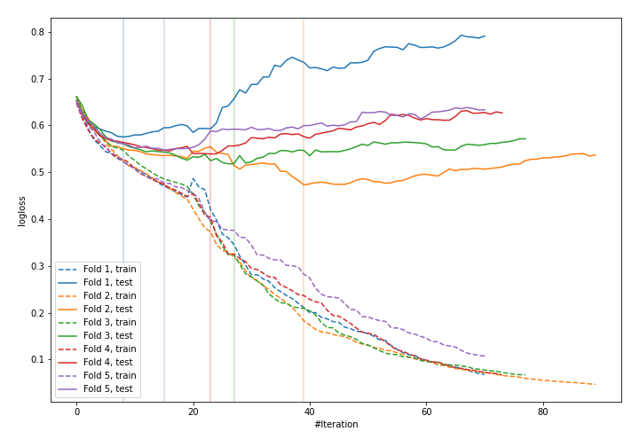
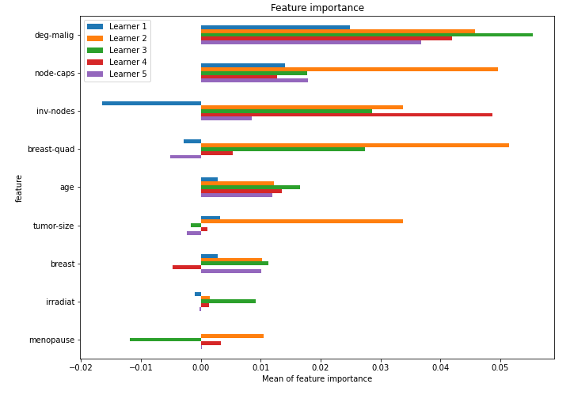

# Summary of 18_CatBoost

[<< Go back](../README.md)

## CatBoost
- **n_jobs**: -1
- **learning_rate**: 0.2
- **depth**: 8
- **rsm**: 1.0
- **loss_function**: Logloss
- **explain_level**: 1

## Validation
 - **validation_type**: kfold
 - **k_folds**: 5
 - **shuffle**: True
 - **stratify**: True

## Optimized metric
logloss

## Training time

6.6 seconds

## Metric details
|           |    score |   threshold |
|:----------|---------:|------------:|
| logloss   | 0.533669 |  nan        |
| auc       | 0.721567 |  nan        |
| f1        | 0.55914  |    0.227584 |
| accuracy  | 0.75     |    0.520881 |
| precision | 0.8      |    0.58759  |
| recall    | 1        |    0.058886 |
| mcc       | 0.340758 |    0.227584 |

## Confusion matrix (at threshold=0.520881)
|                     |   Predicted as negative |   Predicted as positive |
|:--------------------|------------------------:|------------------------:|
| Labeled as negative |                     159 |                       4 |
| Labeled as positive |                      53 |                      12 |

## Learning curves

## Permutation-based Importance

[<< Go back](../README.md)
