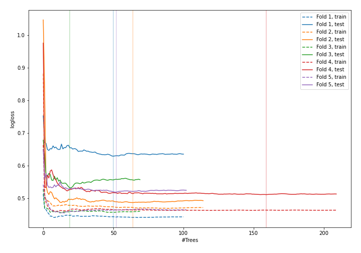
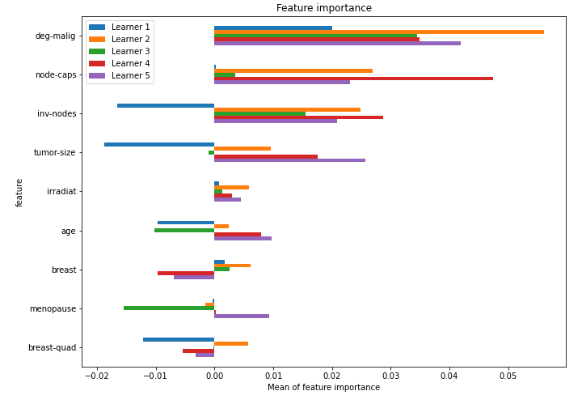

# Summary of 19_RandomForest

[<< Go back](../README.md)

## Random Forest
- **n_jobs**: -1
- **criterion**: gini
- **max_features**: 0.5
- **min_samples_split**: 20
- **max_depth**: 4
- **explain_level**: 1

## Validation
 - **validation_type**: kfold
 - **k_folds**: 5
 - **shuffle**: True
 - **stratify**: True

## Optimized metric
logloss

## Training time

9.6 seconds

## Metric details
|           |    score |   threshold |
|:----------|---------:|------------:|
| logloss   | 0.535316 | nan         |
| auc       | 0.705521 | nan         |
| f1        | 0.522727 |   0.270821  |
| accuracy  | 0.75     |   0.43728   |
| precision | 0.833333 |   0.641103  |
| recall    | 1        |   0.0256838 |
| mcc       | 0.33616  |   0.426253  |

## Confusion matrix (at threshold=0.43728)
|                     |   Predicted as negative |   Predicted as positive |
|:--------------------|------------------------:|------------------------:|
| Labeled as negative |                     146 |                      17 |
| Labeled as positive |                      40 |                      25 |

## Learning curves

## Permutation-based Importance

[<< Go back](../README.md)
