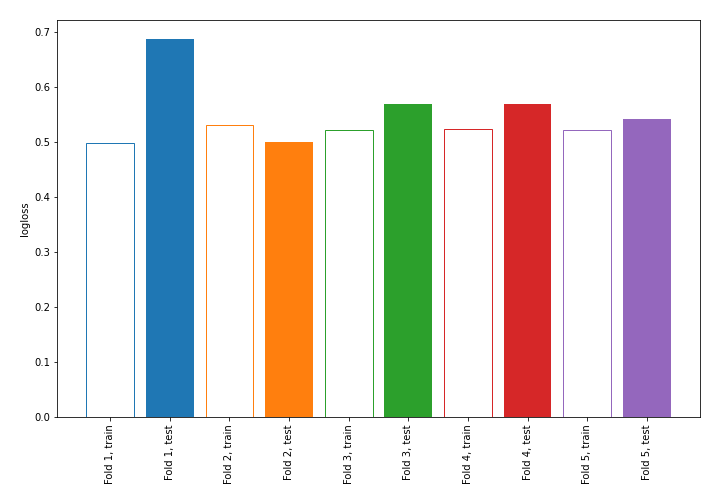
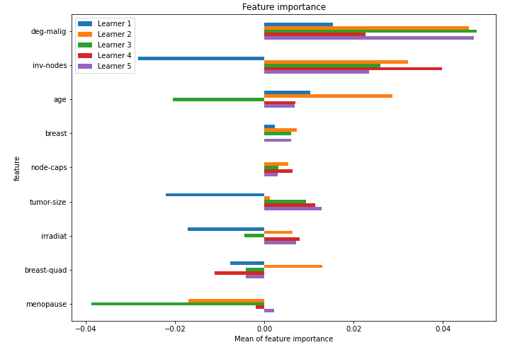

# Summary of 1_Linear

[<< Go back](../README.md)

## Logistic Regression (Linear)
- **n_jobs**: -1
- **explain_level**: 1

## Validation
 - **validation_type**: kfold
 - **k_folds**: 5
 - **shuffle**: True
 - **stratify**: True

## Optimized metric
logloss

## Training time

8.1 seconds

## Metric details
|           |    score |   threshold |
|:----------|---------:|------------:|
| logloss   | 0.573976 | nan         |
| auc       | 0.671543 | nan         |
| f1        | 0.518987 |   0.308481  |
| accuracy  | 0.741228 |   0.557787  |
| precision | 0.625    |   0.557787  |
| recall    | 1        |   0.0339967 |
| mcc       | 0.325183 |   0.409163  |

## Confusion matrix (at threshold=0.557787)
|                     |   Predicted as negative |   Predicted as positive |
|:--------------------|------------------------:|------------------------:|
| Labeled as negative |                     154 |                       9 |
| Labeled as positive |                      50 |                      15 |

## Learning curves

## Coefficients
| feature     |   Learner_1 |   Learner_2 |   Learner_3 |   Learner_4 |   Learner_5 |
|:------------|------------:|------------:|------------:|------------:|------------:|
| deg-malig   |  0.410516   |   0.336233  |   0.440159  |  0.556856   |   0.426343  |
| inv-nodes   |  0.568554   |   0.349237  |   0.378264  |  0.158039   |   0.30749   |
| tumor-size  |  0.329998   |   0.267903  |   0.104584  |  0.21785    |   0.233662  |
| node-caps   |  0.0119521  |   0.149614  |   0.0929314 |  0.273079   |   0.248589  |
| irradiat    |  0.180184   |   0.0697326 |   0.172583  |  0.0559245  |   0.140952  |
| breast-quad |  0.146475   |   0.167854  |   0.161535  | -0.104254   |   0.158281  |
| menopause   | -0.00261578 |  -0.154966  |   0.205723  | -0.0618451  |   0.0823128 |
| breast      | -0.194339   |  -0.15509   |  -0.0951283 |  0.00802769 |  -0.127789  |
| age         | -0.132675   |  -0.213755  |  -0.161435  | -0.22068    |  -0.074363  |
| intercept   | -1.09984    |  -1.04507   |  -1.06717   | -1.08251    |  -1.07339   |

## Permutation-based Importance

[<< Go back](../README.md)
