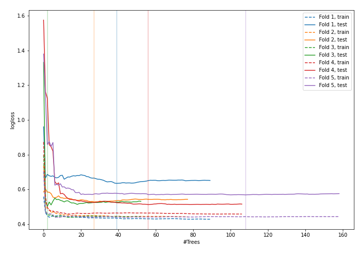
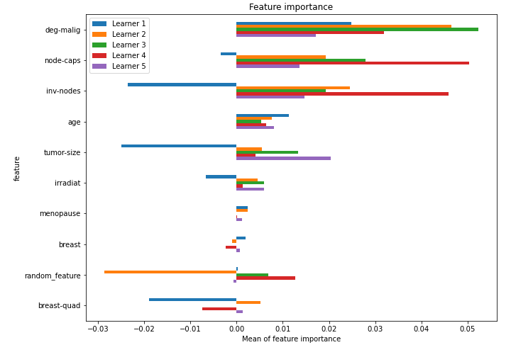

# Summary of 20_RandomForest_RandomFeature

[<< Go back](../README.md)

## Random Forest
- **n_jobs**: -1
- **criterion**: gini
- **max_features**: 0.7
- **min_samples_split**: 30
- **max_depth**: 7
- **explain_level**: 1

## Validation
 - **validation_type**: kfold
 - **k_folds**: 5
 - **shuffle**: True
 - **stratify**: True

## Optimized metric
logloss

## Training time

9.9 seconds

## Metric details
|           |    score |   threshold |
|:----------|---------:|------------:|
| logloss   | 0.547952 |  nan        |
| auc       | 0.703209 |  nan        |
| f1        | 0.56     |    0.34314  |
| accuracy  | 0.758772 |    0.507117 |
| precision | 0.916667 |    0.60371  |
| recall    | 1        |    0        |
| mcc       | 0.356972 |    0.34314  |

## Confusion matrix (at threshold=0.507117)
|                     |   Predicted as negative |   Predicted as positive |
|:--------------------|------------------------:|------------------------:|
| Labeled as negative |                     155 |                       8 |
| Labeled as positive |                      47 |                      18 |

## Learning curves

## Permutation-based Importance

[<< Go back](../README.md)
