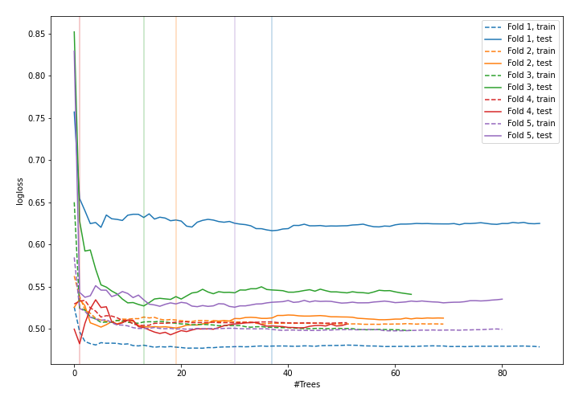
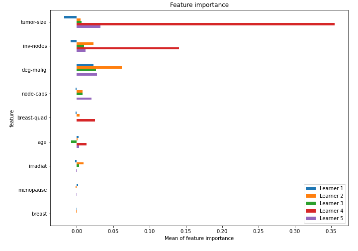

# Summary of 21_RandomForest

[<< Go back](../README.md)

## Random Forest
- **n_jobs**: -1
- **criterion**: gini
- **max_features**: 0.8
- **min_samples_split**: 40
- **max_depth**: 3
- **explain_level**: 1

## Validation
 - **validation_type**: kfold
 - **k_folds**: 5
 - **shuffle**: True
 - **stratify**: True

## Optimized metric
logloss

## Training time

7.2 seconds

## Metric details
|           |    score |   threshold |
|:----------|---------:|------------:|
| logloss   | 0.530703 |  nan        |
| auc       | 0.71883  |  nan        |
| f1        | 0.544118 |    0.386802 |
| accuracy  | 0.754386 |    0.423236 |
| precision | 0.653846 |    0.475283 |
| recall    | 1        |    0        |
| mcc       | 0.365478 |    0.423236 |

## Confusion matrix (at threshold=0.423236)
|                     |   Predicted as negative |   Predicted as positive |
|:--------------------|------------------------:|------------------------:|
| Labeled as negative |                     141 |                      22 |
| Labeled as positive |                      34 |                      31 |

## Learning curves

## Permutation-based Importance

[<< Go back](../README.md)
