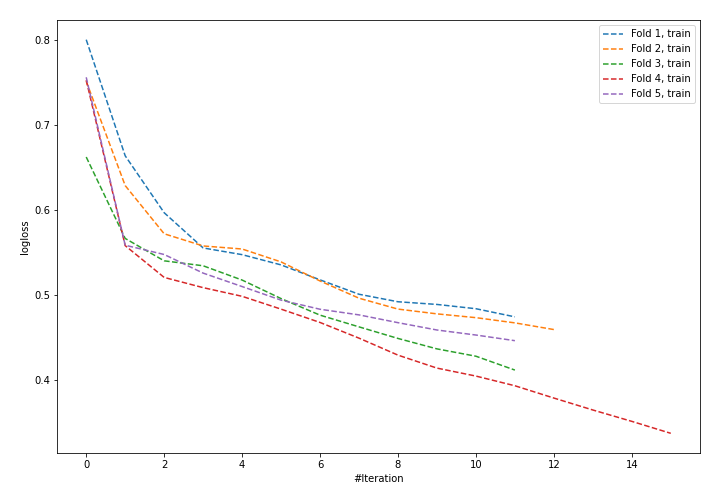
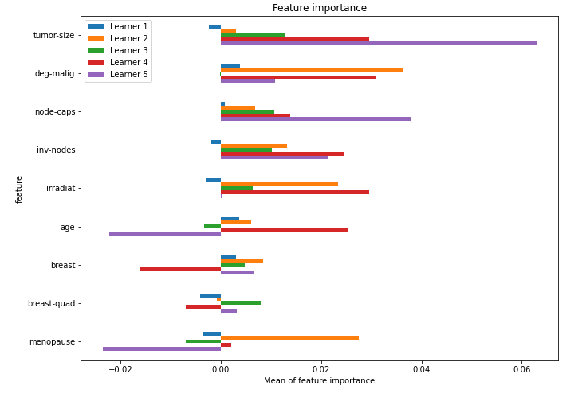

# Summary of 23_NeuralNetwork

[<< Go back](../README.md)

## Neural Network
- **n_jobs**: -1
- **dense_1_size**: 32
- **dense_2_size**: 4
- **learning_rate**: 0.05
- **explain_level**: 1

## Validation
 - **validation_type**: kfold
 - **k_folds**: 5
 - **shuffle**: True
 - **stratify**: True

## Optimized metric
logloss

## Training time

1.7 seconds

## Metric details
|           |    score |   threshold |
|:----------|---------:|------------:|
| logloss   | 0.589447 | nan         |
| auc       | 0.659368 | nan         |
| f1        | 0.519337 |   0.358817  |
| accuracy  | 0.723684 |   0.518795  |
| precision | 0.555556 |   0.518795  |
| recall    | 1        |   0.0151189 |
| mcc       | 0.270702 |   0.358817  |

## Confusion matrix (at threshold=0.518795)
|                     |   Predicted as negative |   Predicted as positive |
|:--------------------|------------------------:|------------------------:|
| Labeled as negative |                     155 |                       8 |
| Labeled as positive |                      55 |                      10 |

## Learning curves

## Permutation-based Importance

[<< Go back](../README.md)
