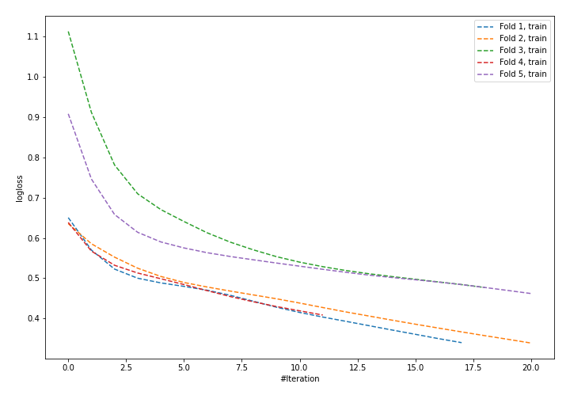

# Summary of 24_NeuralNetwork

[<< Go back](../README.md)

## Neural Network
- **n_jobs**: -1
- **dense_1_size**: 64
- **dense_2_size**: 16
- **learning_rate**: 0.01
- **explain_level**: 1

## Validation
 - **validation_type**: kfold
 - **k_folds**: 5
 - **shuffle**: True
 - **stratify**: True

## Optimized metric
logloss

## Training time

2.3 seconds

## Metric details
|           |    score |    threshold |
|:----------|---------:|-------------:|
| logloss   | 0.623041 | nan          |
| auc       | 0.606607 | nan          |
| f1        | 0.447368 |   0.147961   |
| accuracy  | 0.732456 |   0.498512   |
| precision | 0.6      |   0.583505   |
| recall    | 1        |   0.00770233 |
| mcc       | 0.234351 |   0.375624   |

## Confusion matrix (at threshold=0.498512)
|                     |   Predicted as negative |   Predicted as positive |
|:--------------------|------------------------:|------------------------:|
| Labeled as negative |                     153 |                      10 |
| Labeled as positive |                      51 |                      14 |

## Learning curves

## Permutation-based Importance

[<< Go back](../README.md)
