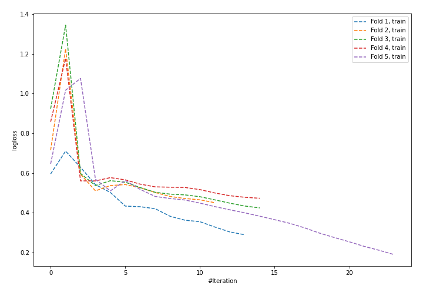
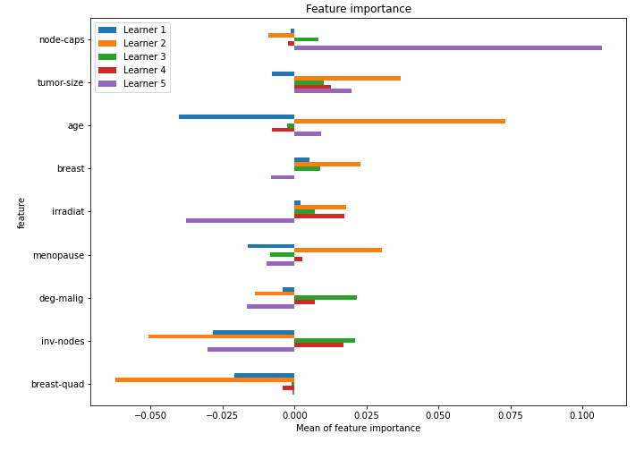

# Summary of 25_NeuralNetwork

[<< Go back](../README.md)

## Neural Network
- **n_jobs**: -1
- **dense_1_size**: 64
- **dense_2_size**: 32
- **learning_rate**: 0.08
- **explain_level**: 1

## Validation
 - **validation_type**: kfold
 - **k_folds**: 5
 - **shuffle**: True
 - **stratify**: True

## Optimized metric
logloss

## Training time

2.3 seconds

## Metric details
|           |    score |     threshold |
|:----------|---------:|--------------:|
| logloss   | 0.758743 | nan           |
| auc       | 0.605521 | nan           |
| f1        | 0.467532 |   0.322318    |
| accuracy  | 0.732456 |   0.481405    |
| precision | 0.666667 |   0.583651    |
| recall    | 1        |   6.18093e-05 |
| mcc       | 0.253837 |   0.481405    |

## Confusion matrix (at threshold=0.481405)
|                     |   Predicted as negative |   Predicted as positive |
|:--------------------|------------------------:|------------------------:|
| Labeled as negative |                     148 |                      15 |
| Labeled as positive |                      46 |                      19 |

## Learning curves

## Permutation-based Importance

[<< Go back](../README.md)
