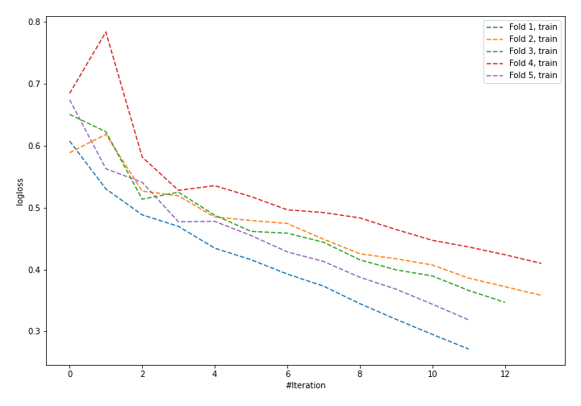
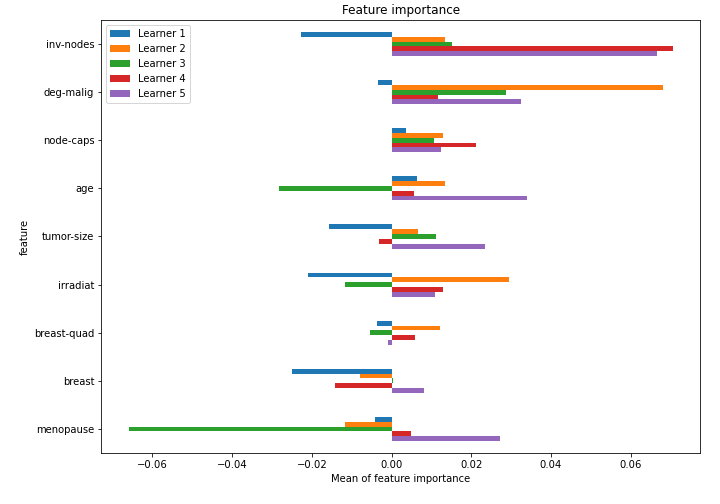

# Summary of 26_NeuralNetwork

[<< Go back](../README.md)

## Neural Network
- **n_jobs**: -1
- **dense_1_size**: 32
- **dense_2_size**: 32
- **learning_rate**: 0.05
- **explain_level**: 1

## Validation
 - **validation_type**: kfold
 - **k_folds**: 5
 - **shuffle**: True
 - **stratify**: True

## Optimized metric
logloss

## Training time

2.6 seconds

## Metric details
|           |    score |    threshold |
|:----------|---------:|-------------:|
| logloss   | 0.563227 | nan          |
| auc       | 0.681076 | nan          |
| f1        | 0.558442 |   0.304568   |
| accuracy  | 0.736842 |   0.548749   |
| precision | 0.75     |   0.778029   |
| recall    | 1        |   0.00563586 |
| mcc       | 0.351047 |   0.304568   |

## Confusion matrix (at threshold=0.548749)
|                     |   Predicted as negative |   Predicted as positive |
|:--------------------|------------------------:|------------------------:|
| Labeled as negative |                     151 |                      12 |
| Labeled as positive |                      48 |                      17 |

## Learning curves

## Permutation-based Importance

[<< Go back](../README.md)
