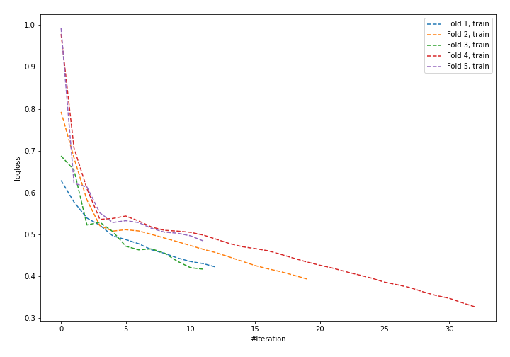
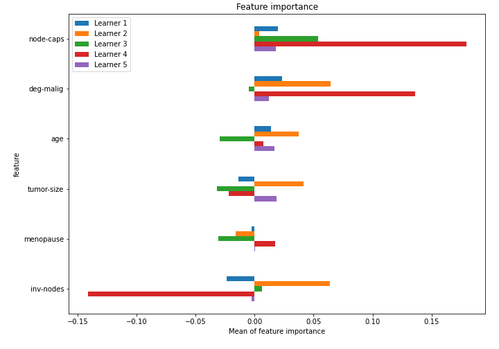

# Summary of 26_NeuralNetwork_SelectedFeatures

[<< Go back](../README.md)

## Neural Network
- **n_jobs**: -1
- **dense_1_size**: 32
- **dense_2_size**: 32
- **learning_rate**: 0.05
- **explain_level**: 1

## Validation
 - **validation_type**: kfold
 - **k_folds**: 5
 - **shuffle**: True
 - **stratify**: True

## Optimized metric
logloss

## Training time

2.0 seconds

## Metric details
|           |    score |     threshold |
|:----------|---------:|--------------:|
| logloss   | 0.665497 | nan           |
| auc       | 0.593535 | nan           |
| f1        | 0.460733 |   0.186755    |
| accuracy  | 0.719298 |   0.567465    |
| precision | 0.529412 |   0.567465    |
| recall    | 1        |   0.000147086 |
| mcc       | 0.177545 |   0.416586    |

## Confusion matrix (at threshold=0.567465)
|                     |   Predicted as negative |   Predicted as positive |
|:--------------------|------------------------:|------------------------:|
| Labeled as negative |                     155 |                       8 |
| Labeled as positive |                      56 |                       9 |

## Learning curves

## Permutation-based Importance

[<< Go back](../README.md)
