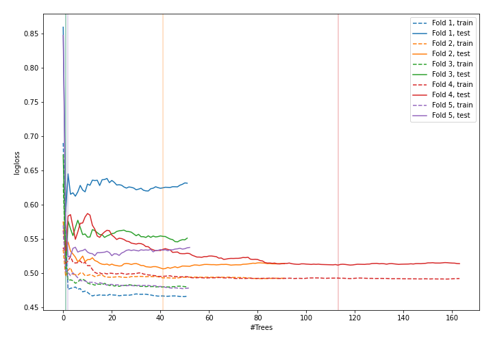
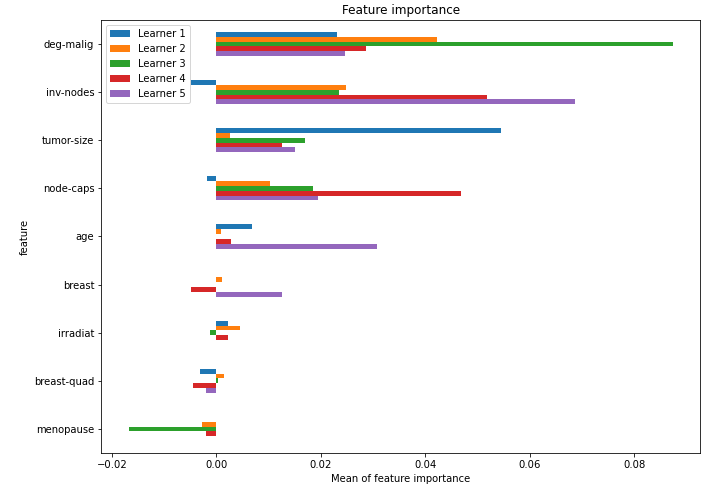

# Summary of 28_RandomForest

[<< Go back](../README.md)

## Random Forest
- **n_jobs**: -1
- **criterion**: gini
- **max_features**: 0.7
- **min_samples_split**: 40
- **max_depth**: 7
- **explain_level**: 1

## Validation
 - **validation_type**: kfold
 - **k_folds**: 5
 - **shuffle**: True
 - **stratify**: True

## Optimized metric
logloss

## Training time

7.6 seconds

## Metric details
|           |    score |   threshold |
|:----------|---------:|------------:|
| logloss   | 0.527725 |  nan        |
| auc       | 0.72369  |  nan        |
| f1        | 0.555556 |    0.364661 |
| accuracy  | 0.745614 |    0.411097 |
| precision | 0.577778 |    0.423845 |
| recall    | 1        |    0        |
| mcc       | 0.356838 |    0.364661 |

## Confusion matrix (at threshold=0.411097)
|                     |   Predicted as negative |   Predicted as positive |
|:--------------------|------------------------:|------------------------:|
| Labeled as negative |                     142 |                      21 |
| Labeled as positive |                      37 |                      28 |

## Learning curves

## Permutation-based Importance

[<< Go back](../README.md)
