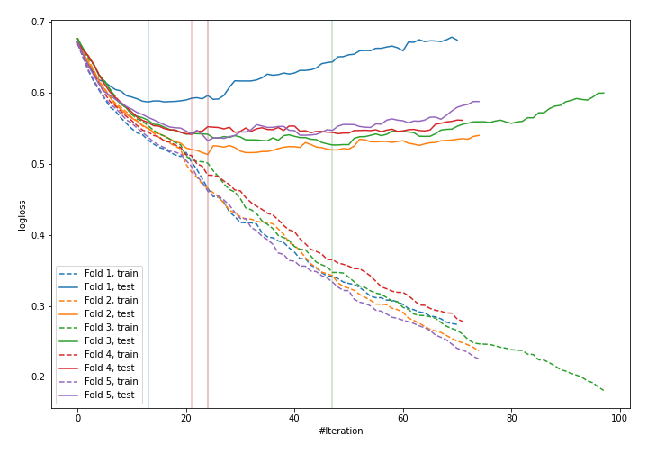
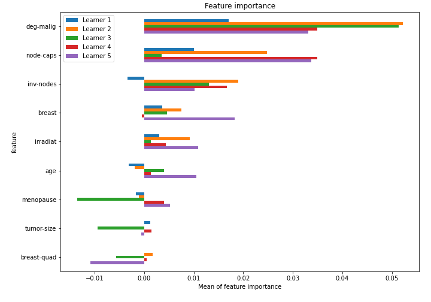

# Summary of 29_CatBoost

[<< Go back](../README.md)

## CatBoost
- **n_jobs**: -1
- **learning_rate**: 0.1
- **depth**: 6
- **rsm**: 0.9
- **loss_function**: Logloss
- **explain_level**: 1

## Validation
 - **validation_type**: kfold
 - **k_folds**: 5
 - **shuffle**: True
 - **stratify**: True

## Optimized metric
logloss

## Training time

3.7 seconds

## Metric details
|           |    score |   threshold |
|:----------|---------:|------------:|
| logloss   | 0.540875 | nan         |
| auc       | 0.707173 | nan         |
| f1        | 0.538922 |   0.326006  |
| accuracy  | 0.767544 |   0.494582  |
| precision | 0.8      |   0.574059  |
| recall    | 1        |   0.0905899 |
| mcc       | 0.354177 |   0.494582  |

## Confusion matrix (at threshold=0.494582)
|                     |   Predicted as negative |   Predicted as positive |
|:--------------------|------------------------:|------------------------:|
| Labeled as negative |                     156 |                       7 |
| Labeled as positive |                      46 |                      19 |

## Learning curves

## Permutation-based Importance

[<< Go back](../README.md)
