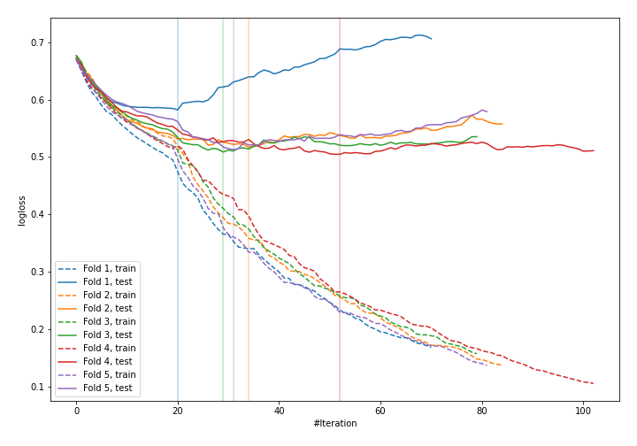
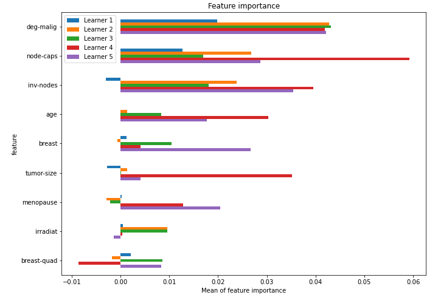

# Summary of 30_CatBoost

[<< Go back](../README.md)

## CatBoost
- **n_jobs**: -1
- **learning_rate**: 0.1
- **depth**: 8
- **rsm**: 0.9
- **loss_function**: Logloss
- **explain_level**: 1

## Validation
 - **validation_type**: kfold
 - **k_folds**: 5
 - **shuffle**: True
 - **stratify**: True

## Optimized metric
logloss

## Training time

6.9 seconds

## Metric details
|           |    score |   threshold |
|:----------|---------:|------------:|
| logloss   | 0.52534  | nan         |
| auc       | 0.731194 | nan         |
| f1        | 0.539877 |   0.272315  |
| accuracy  | 0.767544 |   0.450586  |
| precision | 0.8125   |   0.535514  |
| recall    | 1        |   0.0580484 |
| mcc       | 0.360166 |   0.450586  |

## Confusion matrix (at threshold=0.450586)
|                     |   Predicted as negative |   Predicted as positive |
|:--------------------|------------------------:|------------------------:|
| Labeled as negative |                     153 |                      10 |
| Labeled as positive |                      43 |                      22 |

## Learning curves

## Permutation-based Importance

[<< Go back](../README.md)
