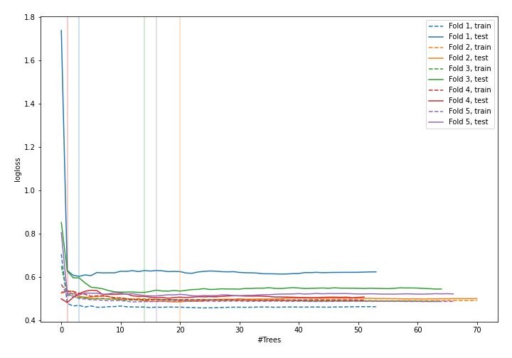
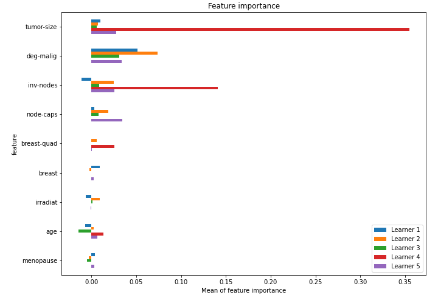

# Summary of 31_RandomForest

[<< Go back](../README.md)

## Random Forest
- **n_jobs**: -1
- **criterion**: gini
- **max_features**: 0.8
- **min_samples_split**: 30
- **max_depth**: 3
- **explain_level**: 1

## Validation
 - **validation_type**: kfold
 - **k_folds**: 5
 - **shuffle**: True
 - **stratify**: True

## Optimized metric
logloss

## Training time

5.3 seconds

## Metric details
|           |    score |   threshold |
|:----------|---------:|------------:|
| logloss   | 0.52277  |  nan        |
| auc       | 0.728315 |  nan        |
| f1        | 0.569231 |    0.386903 |
| accuracy  | 0.763158 |    0.453026 |
| precision | 0.833333 |    0.598997 |
| recall    | 1        |    0        |
| mcc       | 0.397452 |    0.386903 |

## Confusion matrix (at threshold=0.453026)
|                     |   Predicted as negative |   Predicted as positive |
|:--------------------|------------------------:|------------------------:|
| Labeled as negative |                     150 |                      13 |
| Labeled as positive |                      41 |                      24 |

## Learning curves

## Permutation-based Importance

[<< Go back](../README.md)
