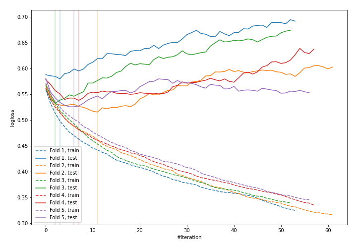
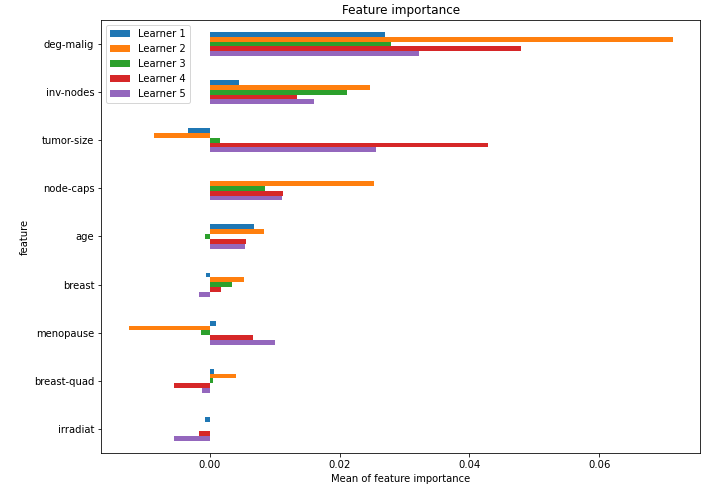

# Summary of 35_LightGBM

[<< Go back](../README.md)

## LightGBM
- **n_jobs**: -1
- **objective**: binary
- **metric**: binary_logloss
- **num_leaves**: 95
- **learning_rate**: 0.2
- **feature_fraction**: 0.9
- **bagging_fraction**: 1.0
- **min_data_in_leaf**: 20
- **explain_level**: 1

## Validation
 - **validation_type**: kfold
 - **k_folds**: 5
 - **shuffle**: True
 - **stratify**: True

## Optimized metric
logloss

## Training time

2.4 seconds

## Metric details
|           |    score |   threshold |
|:----------|---------:|------------:|
| logloss   | 0.538212 | nan         |
| auc       | 0.696413 | nan         |
| f1        | 0.513889 |   0.301078  |
| accuracy  | 0.758772 |   0.427209  |
| precision | 0.909091 |   0.586631  |
| recall    | 1        |   0.0493481 |
| mcc       | 0.326118 |   0.427209  |

## Confusion matrix (at threshold=0.427209)
|                     |   Predicted as negative |   Predicted as positive |
|:--------------------|------------------------:|------------------------:|
| Labeled as negative |                     154 |                       9 |
| Labeled as positive |                      46 |                      19 |

## Learning curves

## Permutation-based Importance

[<< Go back](../README.md)
