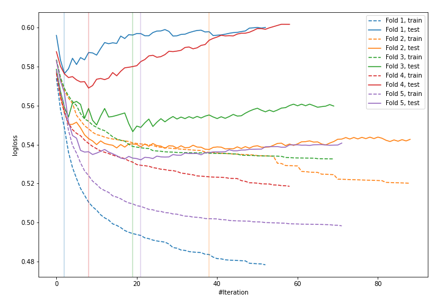
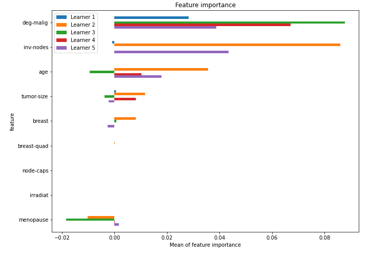

# Summary of 36_LightGBM

[<< Go back](../README.md)

## LightGBM
- **n_jobs**: -1
- **objective**: binary
- **metric**: binary_logloss
- **num_leaves**: 95
- **learning_rate**: 0.2
- **feature_fraction**: 0.9
- **bagging_fraction**: 1.0
- **min_data_in_leaf**: 50
- **explain_level**: 1

## Validation
 - **validation_type**: kfold
 - **k_folds**: 5
 - **shuffle**: True
 - **stratify**: True

## Optimized metric
logloss

## Training time

2.9 seconds

## Metric details
|           |    score |   threshold |
|:----------|---------:|------------:|
| logloss   | 0.552378 | nan         |
| auc       | 0.674941 | nan         |
| f1        | 0.508197 |   0.339037  |
| accuracy  | 0.758772 |   0.478115  |
| precision | 0.75     |   0.521024  |
| recall    | 1        |   0.0934339 |
| mcc       | 0.330934 |   0.339037  |

## Confusion matrix (at threshold=0.478115)
|                     |   Predicted as negative |   Predicted as positive |
|:--------------------|------------------------:|------------------------:|
| Labeled as negative |                     157 |                       6 |
| Labeled as positive |                      49 |                      16 |

## Learning curves

## Permutation-based Importance

[<< Go back](../README.md)
