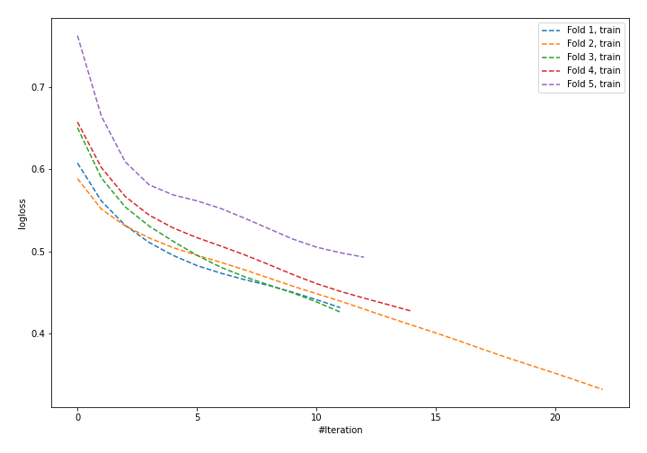
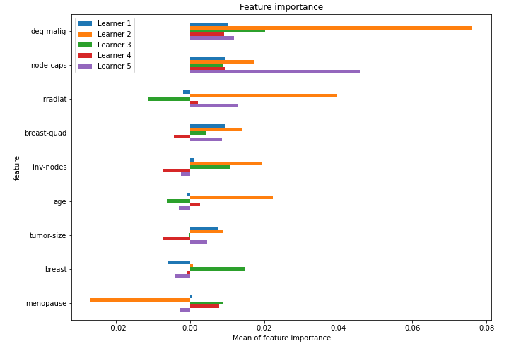

# Summary of 39_NeuralNetwork

[<< Go back](../README.md)

## Neural Network
- **n_jobs**: -1
- **dense_1_size**: 32
- **dense_2_size**: 32
- **learning_rate**: 0.01
- **explain_level**: 1

## Validation
 - **validation_type**: kfold
 - **k_folds**: 5
 - **shuffle**: True
 - **stratify**: True

## Optimized metric
logloss

## Training time

3.0 seconds

## Metric details
|           |    score |   threshold |
|:----------|---------:|------------:|
| logloss   | 0.57489  | nan         |
| auc       | 0.653799 | nan         |
| f1        | 0.492308 |   0.393317  |
| accuracy  | 0.736842 |   0.474815  |
| precision | 0.8      |   0.586678  |
| recall    | 1        |   0.0333496 |
| mcc       | 0.289854 |   0.393317  |

## Confusion matrix (at threshold=0.474815)
|                     |   Predicted as negative |   Predicted as positive |
|:--------------------|------------------------:|------------------------:|
| Labeled as negative |                     156 |                       7 |
| Labeled as positive |                      53 |                      12 |

## Learning curves

## Permutation-based Importance

[<< Go back](../README.md)
