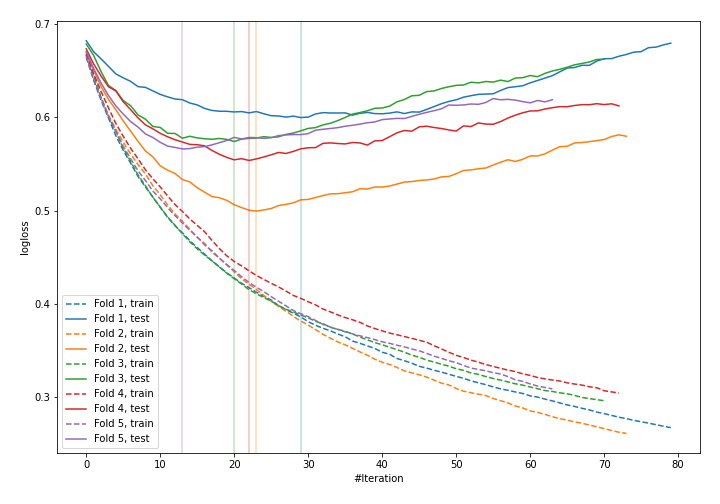
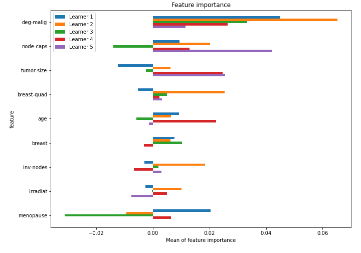

# Summary of 3_Default_Xgboost

[<< Go back](../README.md)

## Extreme Gradient Boosting (Xgboost)
- **n_jobs**: -1
- **objective**: binary:logistic
- **eval_metric**: logloss
- **eta**: 0.075
- **max_depth**: 6
- **min_child_weight**: 1
- **subsample**: 1.0
- **colsample_bytree**: 1.0
- **explain_level**: 1

## Validation
 - **validation_type**: kfold
 - **k_folds**: 5
 - **shuffle**: True
 - **stratify**: True

## Optimized metric
logloss

## Training time

3.4 seconds

## Metric details
|           |    score |   threshold |
|:----------|---------:|------------:|
| logloss   | 0.558709 | nan         |
| auc       | 0.667626 | nan         |
| f1        | 0.513514 |   0.232544  |
| accuracy  | 0.75     |   0.630538  |
| precision | 1        |   0.760607  |
| recall    | 1        |   0.0824552 |
| mcc       | 0.282909 |   0.630538  |

## Confusion matrix (at threshold=0.630538)
|                     |   Predicted as negative |   Predicted as positive |
|:--------------------|------------------------:|------------------------:|
| Labeled as negative |                     159 |                       4 |
| Labeled as positive |                      53 |                      12 |

## Learning curves

## Permutation-based Importance

[<< Go back](../README.md)
