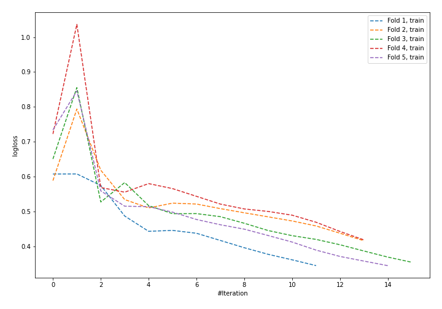

# Summary of 40_NeuralNetwork

[<< Go back](../README.md)

## Neural Network
- **n_jobs**: -1
- **dense_1_size**: 32
- **dense_2_size**: 32
- **learning_rate**: 0.08
- **explain_level**: 1

## Validation
 - **validation_type**: kfold
 - **k_folds**: 5
 - **shuffle**: True
 - **stratify**: True

## Optimized metric
logloss

## Training time

2.2 seconds

## Metric details
|           |    score |     threshold |
|:----------|---------:|--------------:|
| logloss   | 0.609547 | nan           |
| auc       | 0.646437 | nan           |
| f1        | 0.517483 |   0.409193    |
| accuracy  | 0.732456 |   0.724384    |
| precision | 0.75     |   0.808605    |
| recall    | 1        |   0.000327766 |
| mcc       | 0.309639 |   0.430713    |

## Confusion matrix (at threshold=0.724384)
|                     |   Predicted as negative |   Predicted as positive |
|:--------------------|------------------------:|------------------------:|
| Labeled as negative |                     161 |                       2 |
| Labeled as positive |                      59 |                       6 |

## Learning curves

## Permutation-based Importance

[<< Go back](../README.md)
