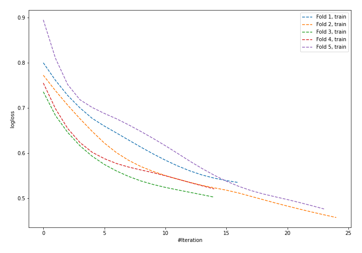

# Summary of 41_NeuralNetwork

[<< Go back](../README.md)

## Neural Network
- **n_jobs**: -1
- **dense_1_size**: 32
- **dense_2_size**: 4
- **learning_rate**: 0.01
- **explain_level**: 1

## Validation
 - **validation_type**: kfold
 - **k_folds**: 5
 - **shuffle**: True
 - **stratify**: True

## Optimized metric
logloss

## Training time

4.4 seconds

## Metric details
|           |    score |    threshold |
|:----------|---------:|-------------:|
| logloss   | 0.598844 | nan          |
| auc       | 0.633695 | nan          |
| f1        | 0.520231 |   0.413207   |
| accuracy  | 0.723684 |   0.526835   |
| precision | 0.571429 |   0.624602   |
| recall    | 1        |   0.00990521 |
| mcc       | 0.276498 |   0.413207   |

## Confusion matrix (at threshold=0.526835)
|                     |   Predicted as negative |   Predicted as positive |
|:--------------------|------------------------:|------------------------:|
| Labeled as negative |                     154 |                       9 |
| Labeled as positive |                      54 |                      11 |

## Learning curves

## Permutation-based Importance

[<< Go back](../README.md)
