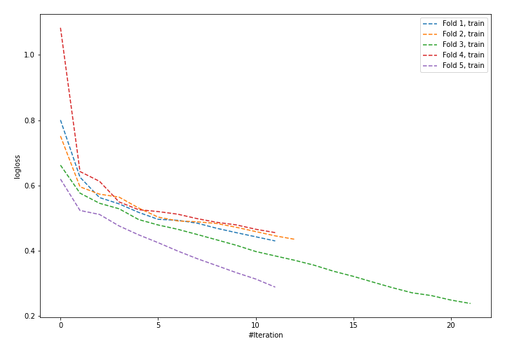
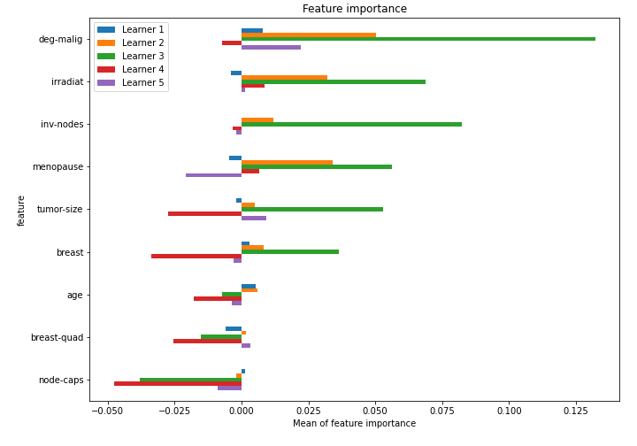

# Summary of 42_NeuralNetwork

[<< Go back](../README.md)

## Neural Network
- **n_jobs**: -1
- **dense_1_size**: 32
- **dense_2_size**: 4
- **learning_rate**: 0.08
- **explain_level**: 1

## Validation
 - **validation_type**: kfold
 - **k_folds**: 5
 - **shuffle**: True
 - **stratify**: True

## Optimized metric
logloss

## Training time

1.8 seconds

## Metric details
|           |    score |   threshold |
|:----------|---------:|------------:|
| logloss   | 0.621424 | nan         |
| auc       | 0.625389 | nan         |
| f1        | 0.482353 |   0.279906  |
| accuracy  | 0.732456 |   0.53344   |
| precision | 0.7      |   0.53344   |
| recall    | 1        |   0.0116474 |
| mcc       | 0.215685 |   0.279906  |

## Confusion matrix (at threshold=0.53344)
|                     |   Predicted as negative |   Predicted as positive |
|:--------------------|------------------------:|------------------------:|
| Labeled as negative |                     160 |                       3 |
| Labeled as positive |                      58 |                       7 |

## Learning curves

## Permutation-based Importance

[<< Go back](../README.md)
