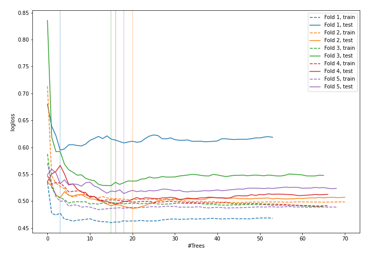
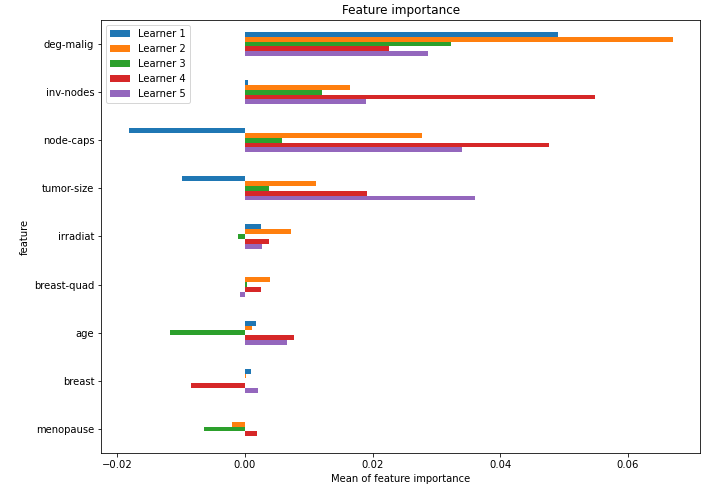

# Summary of 43_RandomForest

[<< Go back](../README.md)

## Random Forest
- **n_jobs**: -1
- **criterion**: gini
- **max_features**: 0.7
- **min_samples_split**: 30
- **max_depth**: 3
- **explain_level**: 1

## Validation
 - **validation_type**: kfold
 - **k_folds**: 5
 - **shuffle**: True
 - **stratify**: True

## Optimized metric
logloss

## Training time

9.0 seconds

## Metric details
|           |    score |   threshold |
|:----------|---------:|------------:|
| logloss   | 0.523893 | nan         |
| auc       | 0.733978 | nan         |
| f1        | 0.57377  |   0.382366  |
| accuracy  | 0.77193  |   0.398259  |
| precision | 0.692308 |   0.605068  |
| recall    | 1        |   0.0318728 |
| mcc       | 0.420678 |   0.382366  |

## Confusion matrix (at threshold=0.398259)
|                     |   Predicted as negative |   Predicted as positive |
|:--------------------|------------------------:|------------------------:|
| Labeled as negative |                     142 |                      21 |
| Labeled as positive |                      31 |                      34 |

## Learning curves

## Permutation-based Importance

[<< Go back](../README.md)
