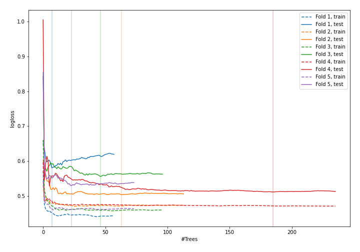
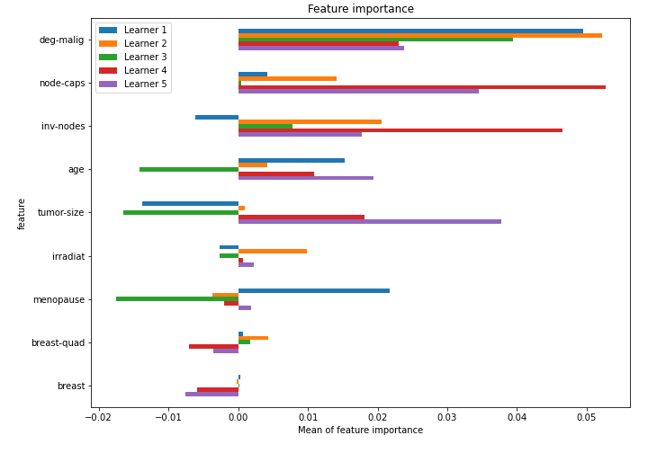

# Summary of 45_RandomForest

[<< Go back](../README.md)

## Random Forest
- **n_jobs**: -1
- **criterion**: gini
- **max_features**: 0.6
- **min_samples_split**: 30
- **max_depth**: 7
- **explain_level**: 1

## Validation
 - **validation_type**: kfold
 - **k_folds**: 5
 - **shuffle**: True
 - **stratify**: True

## Optimized metric
logloss

## Training time

10.7 seconds

## Metric details
|           |    score |   threshold |
|:----------|---------:|------------:|
| logloss   | 0.536545 | nan         |
| auc       | 0.716942 | nan         |
| f1        | 0.549296 |   0.369499  |
| accuracy  | 0.767544 |   0.411081  |
| precision | 0.75     |   0.600074  |
| recall    | 1        |   0.0132812 |
| mcc       | 0.384577 |   0.411081  |

## Confusion matrix (at threshold=0.411081)
|                     |   Predicted as negative |   Predicted as positive |
|:--------------------|------------------------:|------------------------:|
| Labeled as negative |                     146 |                      17 |
| Labeled as positive |                      36 |                      29 |

## Learning curves

## Permutation-based Importance

[<< Go back](../README.md)
