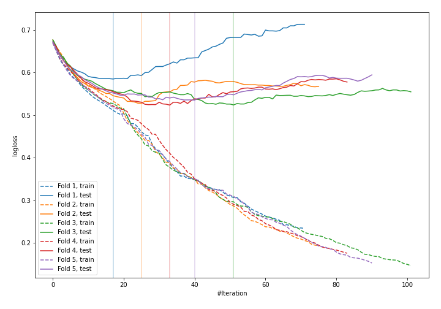
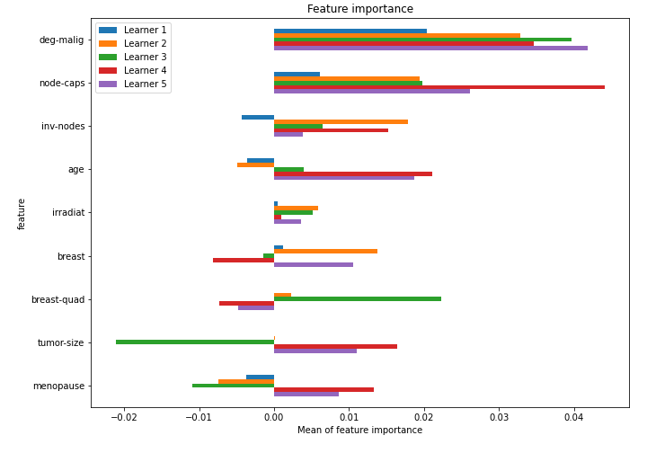

# Summary of 47_CatBoost

[<< Go back](../README.md)

## CatBoost
- **n_jobs**: -1
- **learning_rate**: 0.1
- **depth**: 7
- **rsm**: 0.9
- **loss_function**: Logloss
- **explain_level**: 1

## Validation
 - **validation_type**: kfold
 - **k_folds**: 5
 - **shuffle**: True
 - **stratify**: True

## Optimized metric
logloss

## Training time

4.8 seconds

## Metric details
|           |    score |   threshold |
|:----------|---------:|------------:|
| logloss   | 0.539322 | nan         |
| auc       | 0.698301 | nan         |
| f1        | 0.52381  |   0.257661  |
| accuracy  | 0.77193  |   0.496347  |
| precision | 0.8      |   0.563833  |
| recall    | 1        |   0.0558599 |
| mcc       | 0.369133 |   0.496347  |

## Confusion matrix (at threshold=0.496347)
|                     |   Predicted as negative |   Predicted as positive |
|:--------------------|------------------------:|------------------------:|
| Labeled as negative |                     158 |                       5 |
| Labeled as positive |                      47 |                      18 |

## Learning curves

## Permutation-based Importance

[<< Go back](../README.md)
