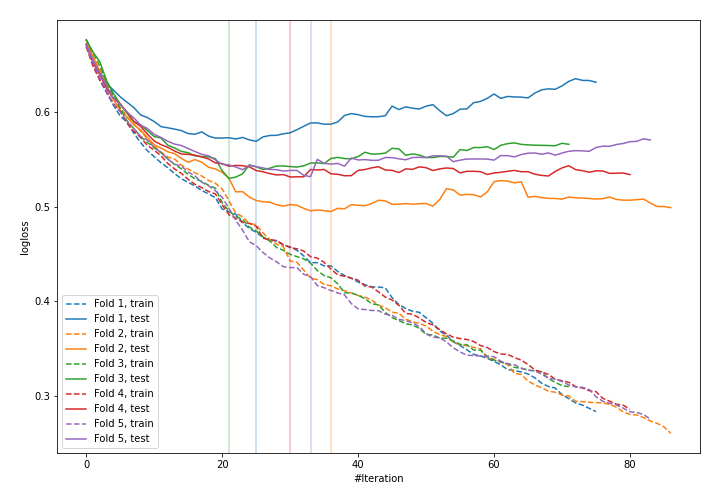
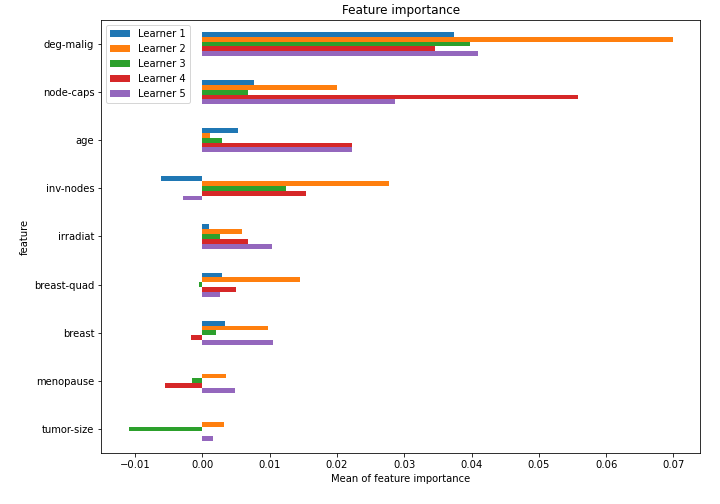

# Summary of 49_CatBoost

[<< Go back](../README.md)

## CatBoost
- **n_jobs**: -1
- **learning_rate**: 0.1
- **depth**: 5
- **rsm**: 1
- **loss_function**: Logloss
- **explain_level**: 1

## Validation
 - **validation_type**: kfold
 - **k_folds**: 5
 - **shuffle**: True
 - **stratify**: True

## Optimized metric
logloss

## Training time

3.1 seconds

## Metric details
|           |    score |   threshold |
|:----------|---------:|------------:|
| logloss   | 0.531601 |  nan        |
| auc       | 0.7126   |  nan        |
| f1        | 0.564103 |    0.293198 |
| accuracy  | 0.767544 |    0.449381 |
| precision | 0.789474 |    0.510561 |
| recall    | 1        |    0.102072 |
| mcc       | 0.35822  |    0.293198 |

## Confusion matrix (at threshold=0.449381)
|                     |   Predicted as negative |   Predicted as positive |
|:--------------------|------------------------:|------------------------:|
| Labeled as negative |                     155 |                       8 |
| Labeled as positive |                      45 |                      20 |

## Learning curves

## Permutation-based Importance

[<< Go back](../README.md)
