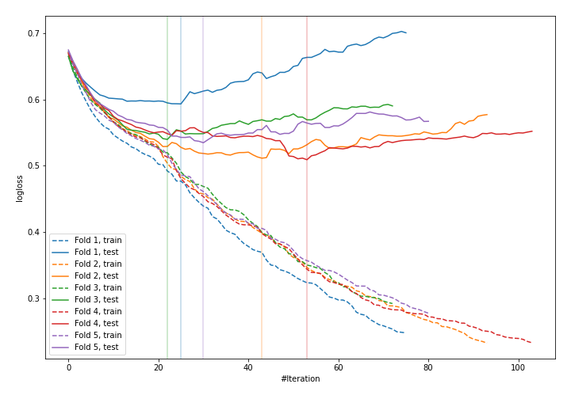
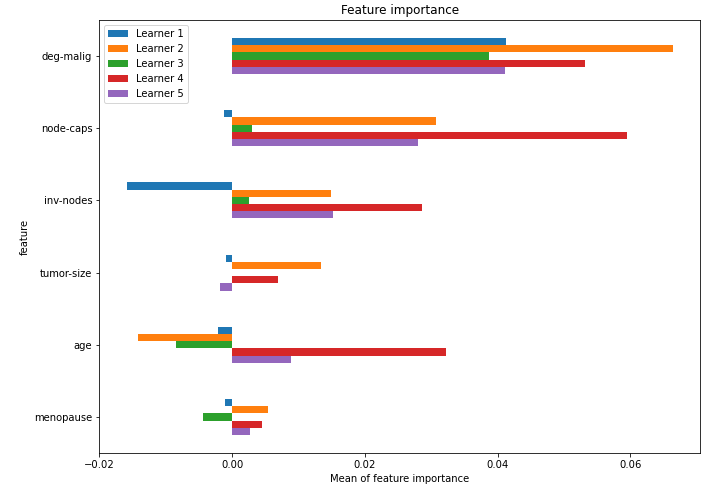

# Summary of 4_Default_CatBoost_SelectedFeatures

[<< Go back](../README.md)

## CatBoost
- **n_jobs**: -1
- **learning_rate**: 0.1
- **depth**: 6
- **rsm**: 1
- **loss_function**: Logloss
- **explain_level**: 1

## Validation
 - **validation_type**: kfold
 - **k_folds**: 5
 - **shuffle**: True
 - **stratify**: True

## Optimized metric
logloss

## Training time

3.9 seconds

## Metric details
|           |    score |   threshold |
|:----------|---------:|------------:|
| logloss   | 0.537952 |  nan        |
| auc       | 0.699198 |  nan        |
| f1        | 0.52349  |    0.284252 |
| accuracy  | 0.754386 |    0.465798 |
| precision | 0.785714 |    0.581805 |
| recall    | 1        |    0.08072  |
| mcc       | 0.31639  |    0.465798 |

## Confusion matrix (at threshold=0.465798)
|                     |   Predicted as negative |   Predicted as positive |
|:--------------------|------------------------:|------------------------:|
| Labeled as negative |                     152 |                      11 |
| Labeled as positive |                      45 |                      20 |

## Learning curves

## Permutation-based Importance

[<< Go back](../README.md)
