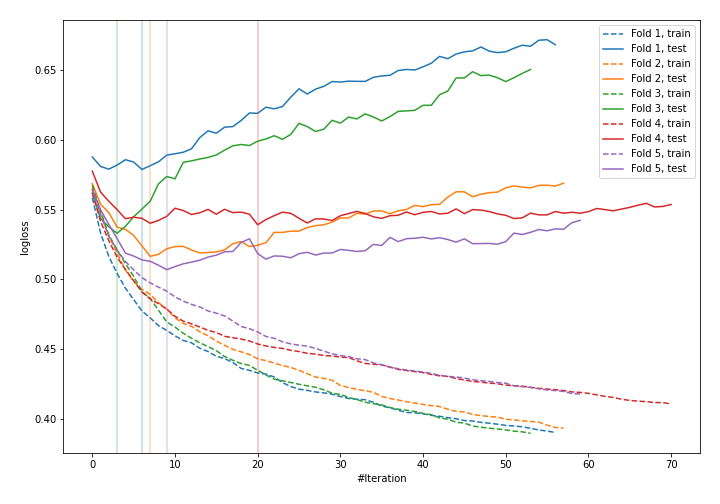
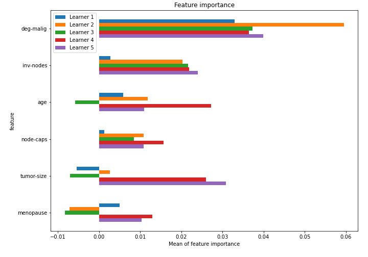

# Summary of 52_LightGBM_SelectedFeatures

[<< Go back](../README.md)

## LightGBM
- **n_jobs**: -1
- **objective**: binary
- **metric**: binary_logloss
- **num_leaves**: 127
- **learning_rate**: 0.2
- **feature_fraction**: 0.9
- **bagging_fraction**: 1.0
- **min_data_in_leaf**: 20
- **explain_level**: 1

## Validation
 - **validation_type**: kfold
 - **k_folds**: 5
 - **shuffle**: True
 - **stratify**: True

## Optimized metric
logloss

## Training time

2.2 seconds

## Metric details
|           |    score |   threshold |
|:----------|---------:|------------:|
| logloss   | 0.534956 | nan         |
| auc       | 0.694431 | nan         |
| f1        | 0.504065 |   0.345713  |
| accuracy  | 0.763158 |   0.425869  |
| precision | 0.888889 |   0.646666  |
| recall    | 1        |   0.0499938 |
| mcc       | 0.347703 |   0.425869  |

## Confusion matrix (at threshold=0.425869)
|                     |   Predicted as negative |   Predicted as positive |
|:--------------------|------------------------:|------------------------:|
| Labeled as negative |                     152 |                      11 |
| Labeled as positive |                      43 |                      22 |

## Learning curves

## Permutation-based Importance

[<< Go back](../README.md)
