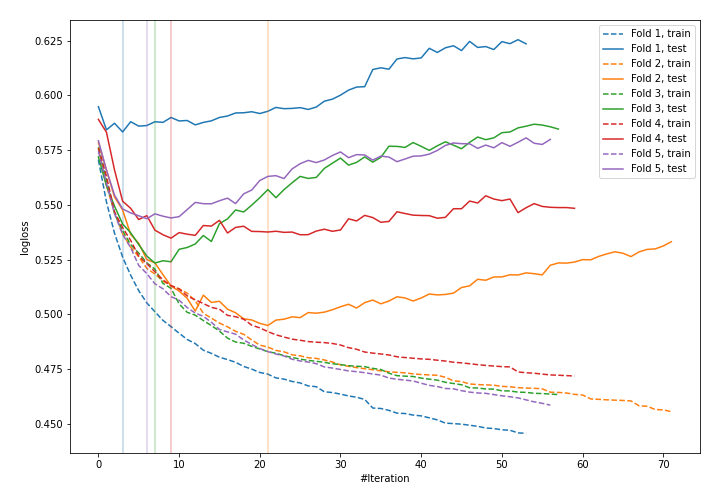
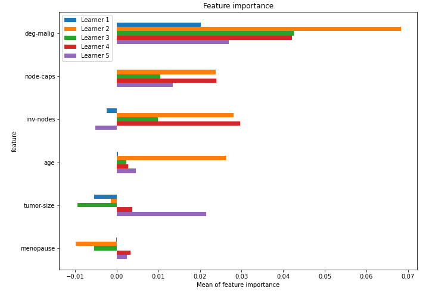

# Summary of 54_LightGBM_SelectedFeatures

[<< Go back](../README.md)

## LightGBM
- **n_jobs**: -1
- **objective**: binary
- **metric**: binary_logloss
- **num_leaves**: 127
- **learning_rate**: 0.2
- **feature_fraction**: 0.9
- **bagging_fraction**: 1.0
- **min_data_in_leaf**: 30
- **explain_level**: 1

## Validation
 - **validation_type**: kfold
 - **k_folds**: 5
 - **shuffle**: True
 - **stratify**: True

## Optimized metric
logloss

## Training time

2.0 seconds

## Metric details
|           |    score |   threshold |
|:----------|---------:|------------:|
| logloss   | 0.535941 | nan         |
| auc       | 0.705097 | nan         |
| f1        | 0.529801 |   0.302021  |
| accuracy  | 0.763158 |   0.493658  |
| precision | 0.761905 |   0.493658  |
| recall    | 1        |   0.0605431 |
| mcc       | 0.343235 |   0.411697  |

## Confusion matrix (at threshold=0.493658)
|                     |   Predicted as negative |   Predicted as positive |
|:--------------------|------------------------:|------------------------:|
| Labeled as negative |                     158 |                       5 |
| Labeled as positive |                      49 |                      16 |

## Learning curves

## Permutation-based Importance

[<< Go back](../README.md)
