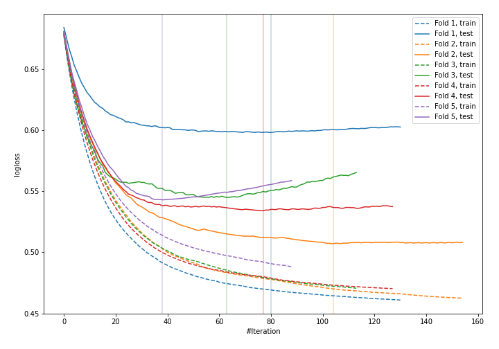
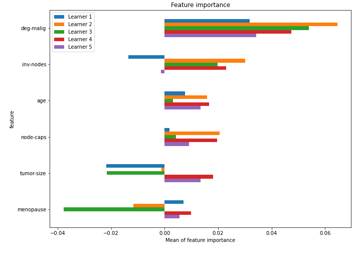

# Summary of 7_Xgboost_SelectedFeatures

[<< Go back](../README.md)

## Extreme Gradient Boosting (Xgboost)
- **n_jobs**: -1
- **objective**: binary:logistic
- **eval_metric**: logloss
- **eta**: 0.05
- **max_depth**: 8
- **min_child_weight**: 5
- **subsample**: 1.0
- **colsample_bytree**: 1.0
- **explain_level**: 1

## Validation
 - **validation_type**: kfold
 - **k_folds**: 5
 - **shuffle**: True
 - **stratify**: True

## Optimized metric
logloss

## Training time

4.1 seconds

## Metric details
|           |    score |   threshold |
|:----------|---------:|------------:|
| logloss   | 0.545425 | nan         |
| auc       | 0.684049 | nan         |
| f1        | 0.518519 |   0.33843   |
| accuracy  | 0.763158 |   0.52546   |
| precision | 0.8      |   0.599473  |
| recall    | 1        |   0.0616762 |
| mcc       | 0.336404 |   0.52546   |

## Confusion matrix (at threshold=0.52546)
|                     |   Predicted as negative |   Predicted as positive |
|:--------------------|------------------------:|------------------------:|
| Labeled as negative |                     158 |                       5 |
| Labeled as positive |                      49 |                      16 |

## Learning curves

## Permutation-based Importance

[<< Go back](../README.md)
