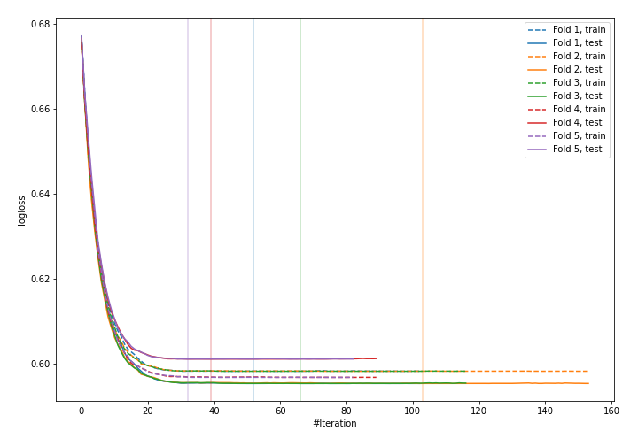
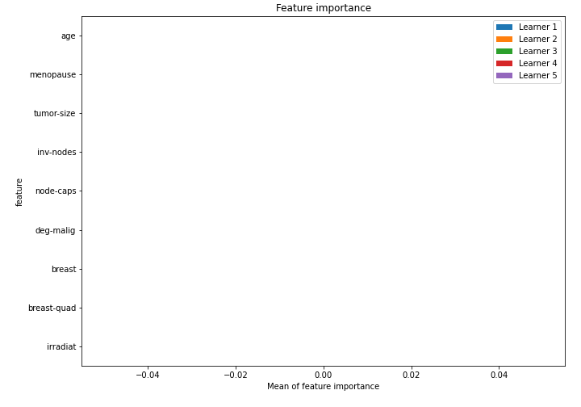

# Summary of 9_Xgboost

[<< Go back](../README.md)

## Extreme Gradient Boosting (Xgboost)
- **n_jobs**: -1
- **objective**: binary:logistic
- **eval_metric**: logloss
- **eta**: 0.1
- **max_depth**: 7
- **min_child_weight**: 25
- **subsample**: 0.9
- **colsample_bytree**: 0.6
- **explain_level**: 1

## Validation
 - **validation_type**: kfold
 - **k_folds**: 5
 - **shuffle**: True
 - **stratify**: True

## Optimized metric
logloss

## Training time

2.4 seconds

## Metric details
|           |     score |   threshold |
|:----------|----------:|------------:|
| logloss   | 0.597671  |  nan        |
| auc       | 0.503681  |  nan        |
| f1        | 0.443686  |    0.254261 |
| accuracy  | 0.631579  |    0.288973 |
| precision | 0.288889  |    0.288973 |
| recall    | 1         |    0.254261 |
| mcc       | 0.0067996 |    0.285967 |

## Confusion matrix (at threshold=0.288973)
|                     |   Predicted as negative |   Predicted as positive |
|:--------------------|------------------------:|------------------------:|
| Labeled as negative |                     131 |                      32 |
| Labeled as positive |                      52 |                      13 |

## Learning curves

## Permutation-based Importance

[<< Go back](../README.md)
