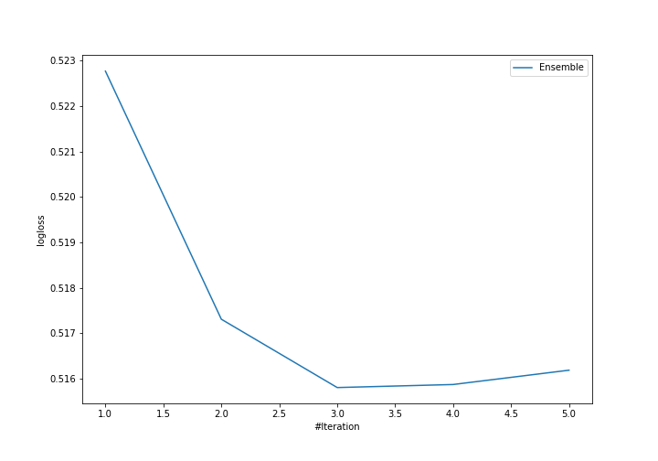

# Summary of Ensemble

[<< Go back](../README.md)

## Ensemble structure
| Model           |   Weight |
|:----------------|---------:|
| 20_RandomForest |        1 |
| 30_CatBoost     |        1 |
| 31_RandomForest |        1 |

## Metric details
|           |    score |   threshold |
|:----------|---------:|------------:|
| logloss   | 0.515799 | nan         |
| auc       | 0.743889 | nan         |
| f1        | 0.578616 |   0.316236  |
| accuracy  | 0.763158 |   0.522207  |
| precision | 0.761905 |   0.522207  |
| recall    | 1        |   0.0360875 |
| mcc       | 0.378974 |   0.316236  |

## Confusion matrix (at threshold=0.522207)
|                     |   Predicted as negative |   Predicted as positive |
|:--------------------|------------------------:|------------------------:|
| Labeled as negative |                     158 |                       5 |
| Labeled as positive |                      49 |                      16 |

## Learning curves

[<< Go back](../README.md)
