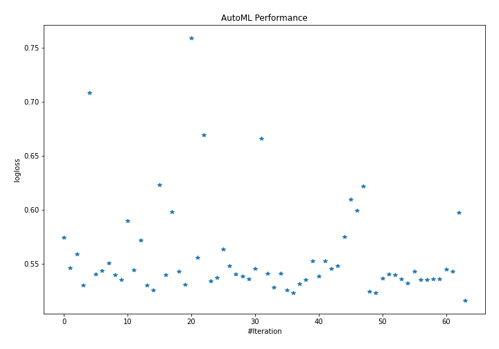
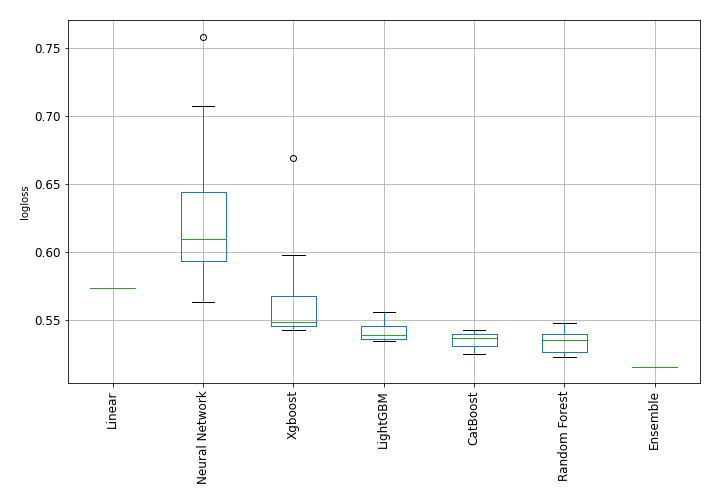

# AutoML Leaderboard

| Best model   | name                                                                                 | model_type     | metric_type   |   metric_value |   train_time |   single_prediction_time |
|:-------------|:-------------------------------------------------------------------------------------|:---------------|:--------------|---------------:|-------------:|-------------------------:|
|              | [1_Linear](1_Linear/README.md)                                                       | Linear         | logloss       |       0.573976 |         8.61 |                   0.1025 |
|              | [2_Default_LightGBM](2_Default_LightGBM/README.md)                                   | LightGBM       | logloss       |       0.546221 |         2.95 |                   0.0793 |
|              | [3_Default_Xgboost](3_Default_Xgboost/README.md)                                     | Xgboost        | logloss       |       0.558709 |         3.92 |                   0.0982 |
|              | [4_Default_CatBoost](4_Default_CatBoost/README.md)                                   | CatBoost       | logloss       |       0.529719 |         4.52 |                   0.0277 |
|              | [5_Default_NeuralNetwork](5_Default_NeuralNetwork/README.md)                         | Neural Network | logloss       |       0.707808 |         2.56 |                   0.1405 |
|              | [6_Default_RandomForest](6_Default_RandomForest/README.md)                           | Random Forest  | logloss       |       0.540084 |         7.15 |                   0.0993 |
|              | [11_LightGBM](11_LightGBM/README.md)                                                 | LightGBM       | logloss       |       0.543665 |         2.84 |                   0.071  |
|              | [7_Xgboost](7_Xgboost/README.md)                                                     | Xgboost        | logloss       |       0.55016  |         3.61 |                   0.086  |
|              | [15_CatBoost](15_CatBoost/README.md)                                                 | CatBoost       | logloss       |       0.539806 |         7.48 |                   0.035  |
|              | [19_RandomForest](19_RandomForest/README.md)                                         | Random Forest  | logloss       |       0.535316 |        10.09 |                   0.1205 |
|              | [23_NeuralNetwork](23_NeuralNetwork/README.md)                                       | Neural Network | logloss       |       0.589447 |         2.13 |                   0.0934 |
|              | [12_LightGBM](12_LightGBM/README.md)                                                 | LightGBM       | logloss       |       0.543792 |         2.97 |                   0.0823 |
|              | [8_Xgboost](8_Xgboost/README.md)                                                     | Xgboost        | logloss       |       0.571297 |         5.27 |                   0.0805 |
|              | [16_CatBoost](16_CatBoost/README.md)                                                 | CatBoost       | logloss       |       0.530038 |         8.76 |                   0.0452 |
|              | [20_RandomForest](20_RandomForest/README.md)                                         | Random Forest  | logloss       |       0.525191 |        13.08 |                   0.1957 |
|              | [24_NeuralNetwork](24_NeuralNetwork/README.md)                                       | Neural Network | logloss       |       0.623041 |         3.13 |                   0.2241 |
|              | [13_LightGBM](13_LightGBM/README.md)                                                 | LightGBM       | logloss       |       0.539786 |         4.48 |                   0.1439 |
|              | [9_Xgboost](9_Xgboost/README.md)                                                     | Xgboost        | logloss       |       0.597671 |         3.04 |                   0.1063 |
|              | [17_CatBoost](17_CatBoost/README.md)                                                 | CatBoost       | logloss       |       0.542503 |         7.35 |                   0.0418 |
|              | [21_RandomForest](21_RandomForest/README.md)                                         | Random Forest  | logloss       |       0.530703 |         7.74 |                   0.0953 |
|              | [25_NeuralNetwork](25_NeuralNetwork/README.md)                                       | Neural Network | logloss       |       0.758743 |         3.04 |                   0.114  |
|              | [14_LightGBM](14_LightGBM/README.md)                                                 | LightGBM       | logloss       |       0.555781 |         3.95 |                   0.1327 |
|              | [10_Xgboost](10_Xgboost/README.md)                                                   | Xgboost        | logloss       |       0.669174 |         2.6  |                   0.097  |
|              | [18_CatBoost](18_CatBoost/README.md)                                                 | CatBoost       | logloss       |       0.533669 |         7.17 |                   0.0295 |
|              | [22_RandomForest](22_RandomForest/README.md)                                         | Random Forest  | logloss       |       0.536738 |         9.75 |                   0.1066 |
|              | [26_NeuralNetwork](26_NeuralNetwork/README.md)                                       | Neural Network | logloss       |       0.563227 |         3.24 |                   0.1143 |
|              | [20_RandomForest_RandomFeature](20_RandomForest_RandomFeature/README.md)             | Random Forest  | logloss       |       0.547952 |        10.68 |                   0.1326 |
|              | [20_RandomForest_SelectedFeatures](20_RandomForest_SelectedFeatures/README.md)       | Random Forest  | logloss       |       0.540062 |         6.93 |                   0.0888 |
|              | [4_Default_CatBoost_SelectedFeatures](4_Default_CatBoost_SelectedFeatures/README.md) | CatBoost       | logloss       |       0.537952 |         4.64 |                   0.0684 |
|              | [13_LightGBM_SelectedFeatures](13_LightGBM_SelectedFeatures/README.md)               | LightGBM       | logloss       |       0.535941 |         3.18 |                   0.1351 |
|              | [7_Xgboost_SelectedFeatures](7_Xgboost_SelectedFeatures/README.md)                   | Xgboost        | logloss       |       0.545425 |         4.66 |                   0.0867 |
|              | [26_NeuralNetwork_SelectedFeatures](26_NeuralNetwork_SelectedFeatures/README.md)     | Neural Network | logloss       |       0.665497 |         2.87 |                   0.1291 |
|              | [27_RandomForest](27_RandomForest/README.md)                                         | Random Forest  | logloss       |       0.541047 |        10.66 |                   0.1896 |
|              | [28_RandomForest](28_RandomForest/README.md)                                         | Random Forest  | logloss       |       0.527725 |         8.19 |                   0.1221 |
|              | [29_CatBoost](29_CatBoost/README.md)                                                 | CatBoost       | logloss       |       0.540875 |         4.29 |                   0.058  |
|              | [30_CatBoost](30_CatBoost/README.md)                                                 | CatBoost       | logloss       |       0.52534  |         7.7  |                   0.0409 |
|              | [31_RandomForest](31_RandomForest/README.md)                                         | Random Forest  | logloss       |       0.52277  |         5.96 |                   0.1065 |
|              | [32_RandomForest](32_RandomForest/README.md)                                         | Random Forest  | logloss       |       0.531179 |         7.08 |                   0.0948 |
|              | [33_LightGBM_SelectedFeatures](33_LightGBM_SelectedFeatures/README.md)               | LightGBM       | logloss       |       0.534956 |         2.93 |                   0.1315 |
|              | [34_LightGBM_SelectedFeatures](34_LightGBM_SelectedFeatures/README.md)               | LightGBM       | logloss       |       0.552489 |         3.14 |                   0.0922 |
|              | [35_LightGBM](35_LightGBM/README.md)                                                 | LightGBM       | logloss       |       0.538212 |         3    |                   0.1082 |
|              | [36_LightGBM](36_LightGBM/README.md)                                                 | LightGBM       | logloss       |       0.552378 |         3.52 |                   0.1428 |
|              | [37_Xgboost_SelectedFeatures](37_Xgboost_SelectedFeatures/README.md)                 | Xgboost        | logloss       |       0.54553  |         4.22 |                   0.1007 |
|              | [38_Xgboost](38_Xgboost/README.md)                                                   | Xgboost        | logloss       |       0.547664 |         4.89 |                   0.1852 |
|              | [39_NeuralNetwork](39_NeuralNetwork/README.md)                                       | Neural Network | logloss       |       0.57489  |         3.76 |                   0.1303 |
|              | [40_NeuralNetwork](40_NeuralNetwork/README.md)                                       | Neural Network | logloss       |       0.609547 |         2.7  |                   0.1576 |
|              | [41_NeuralNetwork](41_NeuralNetwork/README.md)                                       | Neural Network | logloss       |       0.598844 |         5.15 |                   0.1251 |
|              | [42_NeuralNetwork](42_NeuralNetwork/README.md)                                       | Neural Network | logloss       |       0.621424 |         2.29 |                   0.1141 |
|              | [43_RandomForest](43_RandomForest/README.md)                                         | Random Forest  | logloss       |       0.523893 |         9.59 |                   0.0957 |
|              | [44_RandomForest](44_RandomForest/README.md)                                         | Random Forest  | logloss       |       0.522894 |         5.57 |                   0.0912 |
|              | [45_RandomForest](45_RandomForest/README.md)                                         | Random Forest  | logloss       |       0.536545 |        11.22 |                   0.1159 |
|              | [46_RandomForest](46_RandomForest/README.md)                                         | Random Forest  | logloss       |       0.540183 |         9.3  |                   0.1035 |
|              | [47_CatBoost](47_CatBoost/README.md)                                                 | CatBoost       | logloss       |       0.539322 |         5.4  |                   0.0299 |
|              | [48_CatBoost](48_CatBoost/README.md)                                                 | CatBoost       | logloss       |       0.535486 |         8.88 |                   0.0346 |
|              | [49_CatBoost](49_CatBoost/README.md)                                                 | CatBoost       | logloss       |       0.531601 |         3.6  |                   0.0323 |
|              | [50_CatBoost](50_CatBoost/README.md)                                                 | CatBoost       | logloss       |       0.542503 |         4.57 |                   0.0396 |
|              | [51_LightGBM_SelectedFeatures](51_LightGBM_SelectedFeatures/README.md)               | LightGBM       | logloss       |       0.534956 |         2.66 |                   0.0862 |
|              | [52_LightGBM_SelectedFeatures](52_LightGBM_SelectedFeatures/README.md)               | LightGBM       | logloss       |       0.534956 |         2.7  |                   0.1048 |
|              | [53_LightGBM_SelectedFeatures](53_LightGBM_SelectedFeatures/README.md)               | LightGBM       | logloss       |       0.535941 |         2.56 |                   0.0702 |
|              | [54_LightGBM_SelectedFeatures](54_LightGBM_SelectedFeatures/README.md)               | LightGBM       | logloss       |       0.535941 |         2.56 |                   0.082  |
|              | [55_Xgboost_SelectedFeatures](55_Xgboost_SelectedFeatures/README.md)                 | Xgboost        | logloss       |       0.544864 |         3.12 |                   0.0827 |
|              | [56_Xgboost_SelectedFeatures](56_Xgboost_SelectedFeatures/README.md)                 | Xgboost        | logloss       |       0.543002 |         3.15 |                   0.0906 |
|              | [57_NeuralNetwork](57_NeuralNetwork/README.md)                                       | Neural Network | logloss       |       0.597188 |         2.27 |                   0.1097 |
| **the best** | [Ensemble](Ensemble/README.md)                                                       | Ensemble       | logloss       |       0.515799 |         1.84 |                   0.2272 |

### AutoML Performance

### AutoML Performance Boxplot
